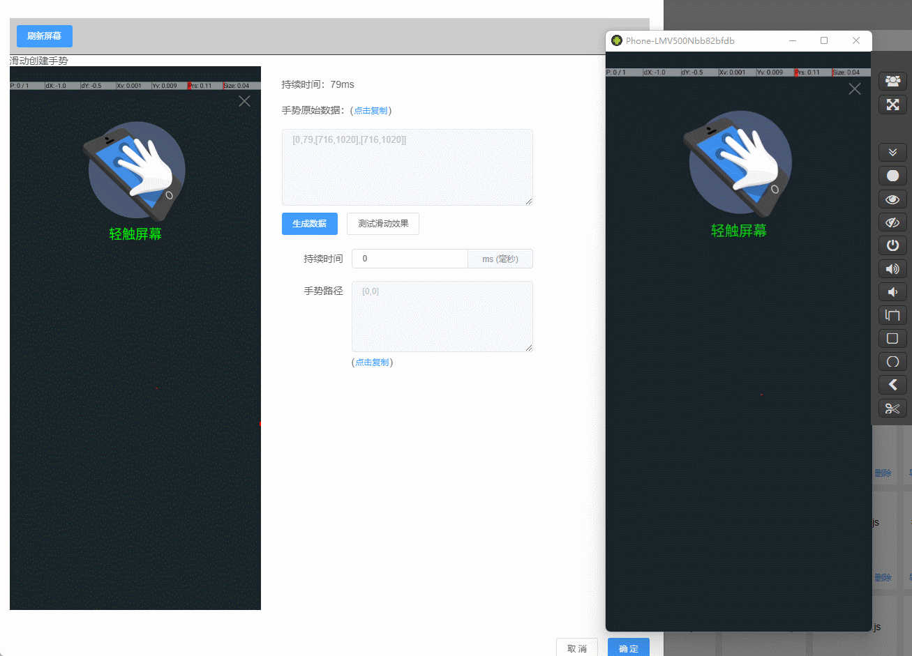
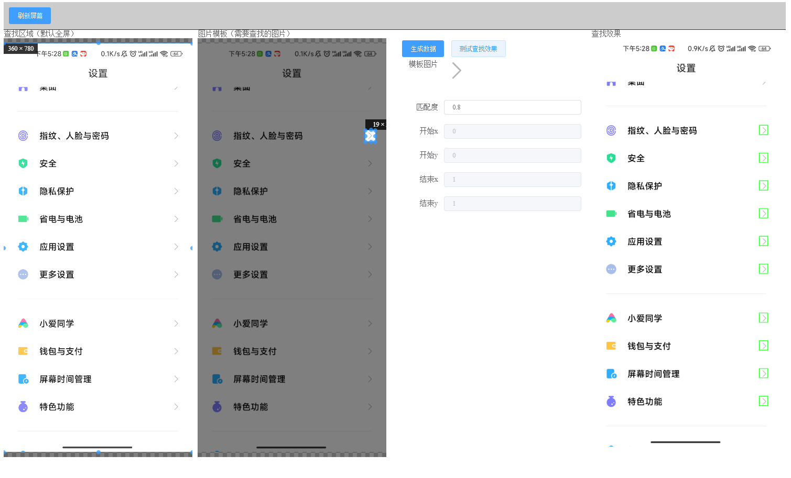
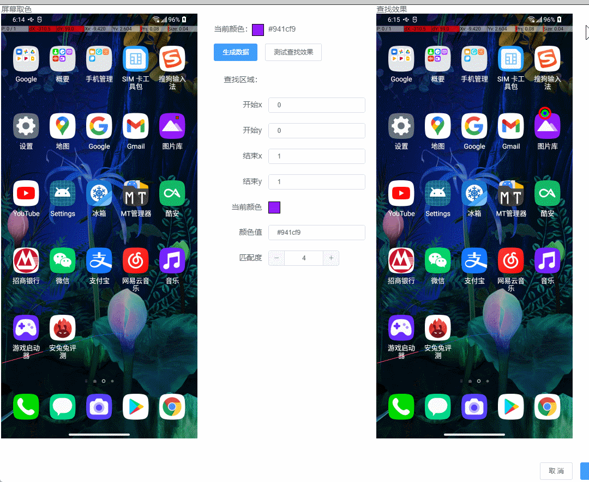
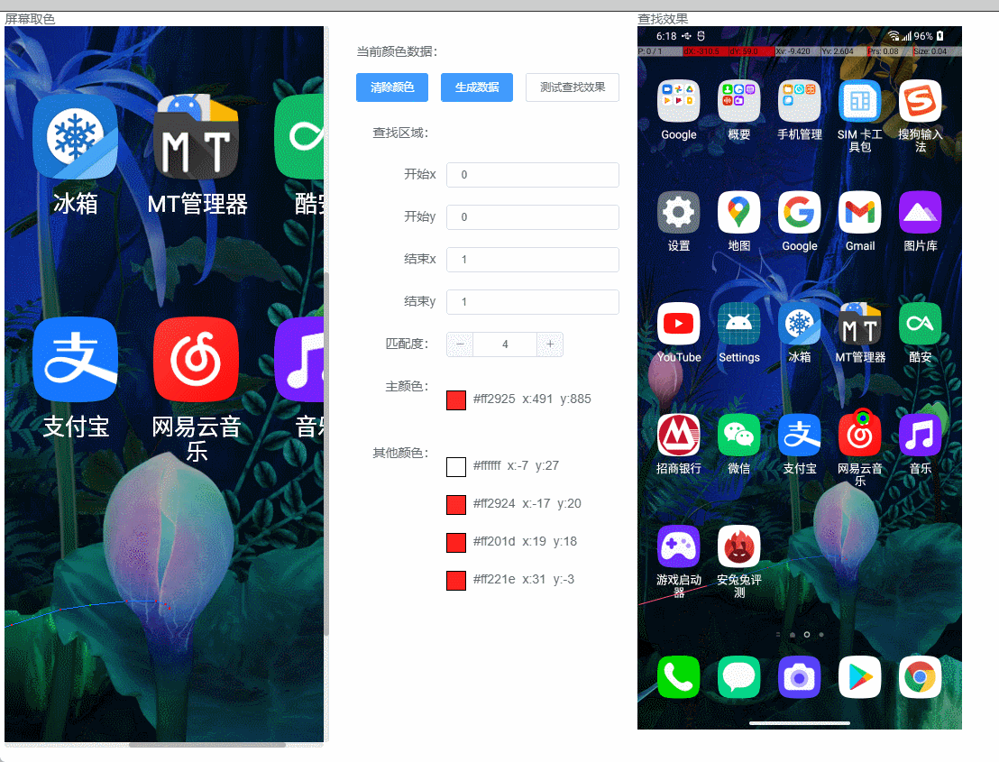
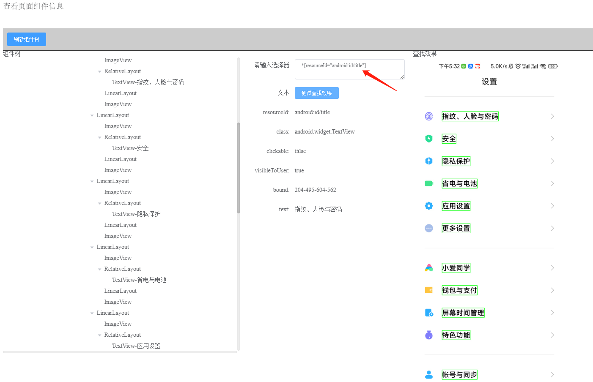
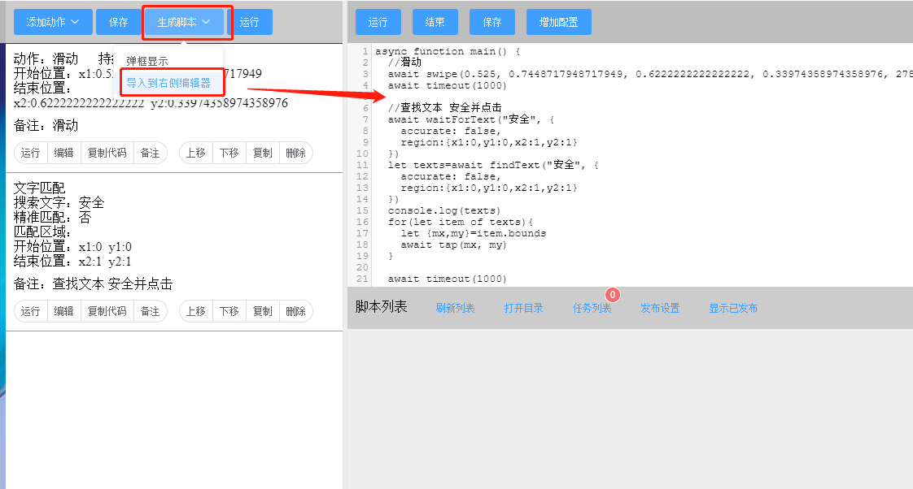
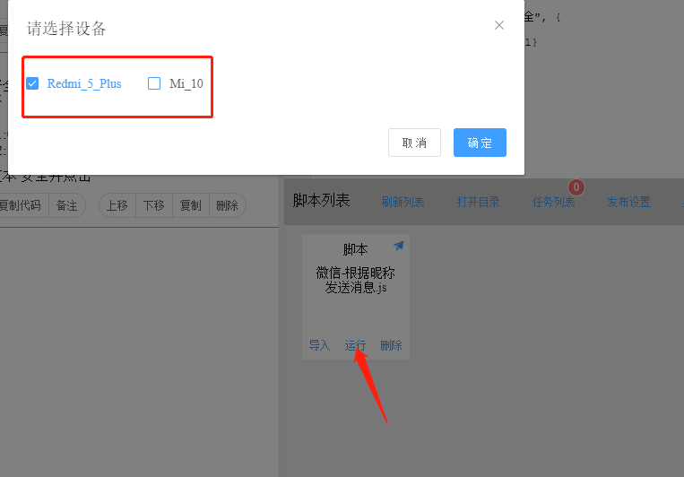

# 快速上手 :id=index

> 10分钟实现自动看抖音，自动点赞

<iframe src="//player.bilibili.com/player.html?aid=469496103&bvid=BV1T541197MS&cid=729346461&page=1" width="100%" height="720px" allowfullscreen="true"> </iframe>

### 你是否遇到了以下痛点？
1，开发阶段：环境搭建复杂，脚本开发缓慢，需要安装各种APP辅助（APP，输入法等），需要申请一堆权限

2，上线阶段：需要自己开发授权系统，脚本分发管理系统，支付系统等

3，客户阶段：需要一台一台手机安装APP，每台都需要申请各种权限

AutoJS PC版：以上都不需要

### AutoJSPC版和同行比有什么优势？

无需安装手机端app，无需开启无障碍权限，无需安装输入法；支持图形化操作，一键生成代码，支持单独运行时（激活码系统，ui配置系统）

### AutoJS PC版是什么？
是一个让开发者在极短时间内、以最小成本实现各种APP辅助（自动化）功能，且帮自己赚米的自动化平台

### AutoJS PC版能干什么？
简单快速创建自动化测试、智能辅助、效率工具、小应用。譬如：自动化测试、自动化运营、批量处理、机器人、自动回复、抓取APP数据、自动签到等等

### 为何选择AutoJS PC版？
图形化添加动作，一键生成代码，多设备运行。简单、实用的js版api，丰富的NodeJS生态

### AutoJsPC版亮点
##### 强大的图形化辅助功能,一键添加动作

####  模拟真人手势，支持多指滑动

##### 便捷的图片查找（模板匹配），快速定位坐标

##### 多色定位，单色定位

##### 多文本匹配，快速定位坐标

##### 内置显示Android View树，JQuery语法快速定位元素

##### 一键代码生成，辅助写代码

##### 一键多设备运行

