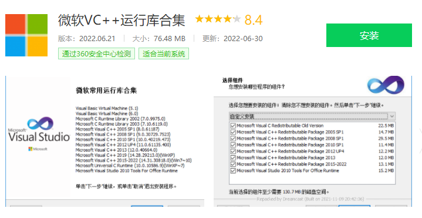

## 需要root权限吗？

不需要

## 需要无障碍权限吗？

3.0以上版本不需要，2.0版本需要

## 支持win7吗？

支持，AutoJSPC版支持win7-win11操作系统

## 支持中文输入吗？

支持，在不需要安装输入法的情况下直接输入中文

## 初次安装，启动报错？

如果你使用的ghost版本系统或者非官方系统（精简版系统），可能缺少系统组件，请搜索安装微软常用VC++运行库合集

## 刷新设备，不能正常显示？
`按照以下步骤操作重试`，一般可以解决问题：
  - 1.检查数据线是否连接正常
  - 2.在手机端->设置->usb调试界面，撤销usb调试授权，关闭usb调试，重新打开
  - 3.点击电脑端刷新设备，手机如果出现允许usb调试，点同意

## 软件部分功能不正常，如无法进行模拟点击，不能使用文字查找，选择器查找，等

如果软件某些功能不正常，请检查以下选项是否在usb调试界面开启，不同手机菜单选项不一样，请找类似的选项：
- usb调试  （未开启的情况下，设备列表不能正常显示设备）
- usb安装   （未开启的情况下，无法使用脚本安装apk）
- usb调试（安全设置）[允许通过usb调试修改权限，模拟点击] （未开启的情况下，脚本不能模拟点击）
- 启用视图属性检查功能   （未开启的情况下，软件不能正确的使用文本查找和选择器查找功能）

oppo的系统需要另外开启：`打开->禁止权限监控`  （未开启的情况下，模拟点击，文本查找，选择器查找等都无法正常使用）

## 部分动作输入框过短，不能输入文字？

3.0版本的PC端已经做了优化适配。2.0版本把autojs全屏幕运行即可（建议使用1080p的屏幕全屏开发）

## ~~点击安装手机客户端，没有安装上？~~
`3.0版本已经移除`
- 点击安装后，部分手机会弹出，是否安装autojs app，点击同意即可
- 手机客户端安装成功后没有图标，默认会切换到adb输入法，随便找个输入框，看输入法是否为autojs adb keyboard，是则表示成功安装

## ~~手机弹框未激活？~~
`3.0版本已经移除`
- 先检查准备工作是否完成
- 开发过程中多个手机的情况下，点击对应手机代表此设备进入开发状态，在准备工作完成的情况下，点击设备列表-对应设备，代表此设备处于激活状态
- 脚本列表的同时运行在多台手机，不受此影响，系统会自动激活手机，运行脚本

