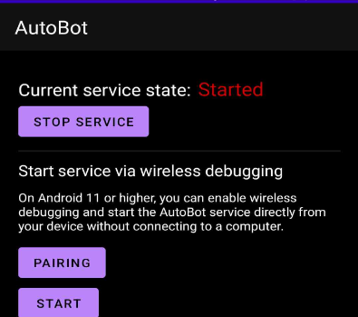
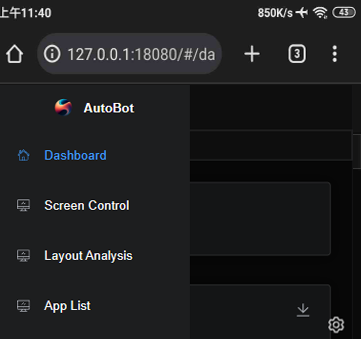
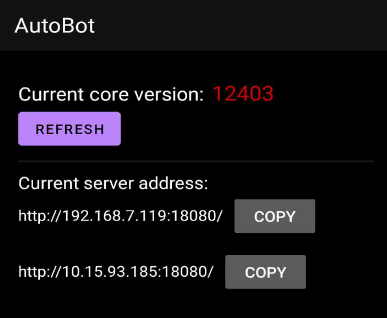

# Activation Principle

The essence of the activation process is to run a server-side application in shell mode. Regular applications have limited permissions and cannot access system functions. Therefore, it's necessary to run the server-side in the `adb shell` or with root shell privileges.

## Android Device System Requirements

Prepare an Android device with system version `7-14` (devices below Android 7.0 can also be attempted).
**Note:** Autobot1 version 1.3.11 and later will no longer support 32-bit Android systems (armv7). Please use 64-bit armv8 systems.

## 1. Install the "autobot.apk" Client

Regardless of the activation method, it is recommended to install the Autobot application.

- [Click here to download the latest version of the APK](./download.md ":target=_blank")

## 2. Enable Developer Options (USB Debugging)

- Most phones can enable Developer Options by going to `Settings -> About Phone -> Tap on Build Number` repeatedly.
- `Different phones may have different methods` to enable Developer Options. You can search for how to enable Developer Options based on your device model.

**Note:**
If certain features of the software (or API calls) are not functioning properly, please check if the following options are enabled in the USB debugging interface. Menu options may vary on different phones, so look for similar options:

- USB Debugging (Without this enabled, you cannot run the server via ADB. If you're running with a root shell, you can skip this part entirely.)
- USB Installation (Without this enabled, you cannot install APKs via the page/interface.)
- USB Debugging (Security Settings) [Allow modification of permissions via USB debugging, simulate clicks] (Without this enabled, scripts cannot simulate clicks.)
- Enable View Attribute Inspection (Without this enabled, the software cannot use layout analysis functionality.)
- Enable Permission Monitoring (If this option is available, please make sure to check it.)

## 3. Activate Through the Autobot Client

- Method 1: For Android 11 and above, after connecting to Wi-Fi, you can directly activate through the client without involving a computer. Follow the program's prompts to proceed.

  `Note:` Once paired successfully, you won't need to pair again. After enabling wireless debugging in the system settings, simply go back to the software and click start.

- Method 2: For Android 7-13 systems, you can manually enable Wi-Fi ADB by connecting a data cable. After enabling, click the start button on the software interface (this method doesn't require pairing and is a universal method, so you can try this when encountering any issues).

  The command to enable is (`Note:` This method requires configuring the adb environment variable. You can search online for how to do this.)

```shell
adb tcpip 5555
```

- TV/Tablet (Option to Enable ADB Only)

  Activation on these types of devices is also quite simple. Just enable ADB and click the system start button on the software interface. No pairing is required.

### Common Issues

- No response when clicking start after successfully pairing using Method 1?

  Please turn off USB debugging, then turn it on again. Restart the device and reconnect to Wi-Fi, then enable wireless debugging. Go back to the software interface and click start.

## Manual Activation

For manual activation, root (one-click start, Magisk flash package) and ROM integration can be discussed privately. [Video tutorial reference](https://space.bilibili.com/1653094687)

## Successful Service Startup

How to confirm if the service has been successfully activated?

- Confirmation through Autobot application



- Confirmation through IP address and port

  - Open the browser on your Android device and enter `http://127.0.0.1:18080`. The page should respond successfully.

    

  - On your computer, if the Android device is connected to Wi-Fi, you can access the device's IP address + port within the local network (you need to find your actual phone's IP address).

    Example: `http://192.168.7.119:18080`

    If you see the same interface as shown above, it indicates that the service has been successfully activated.

  `Note: You can check the device's IP by switching to the "My Devices" page in the application`

  
