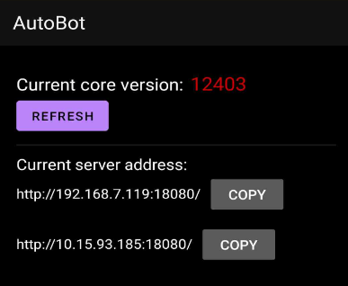

Once the client service is successfully running, you will obtain the service's address, as shown in the image below:



You can directly access the corresponding connection address, for example: `http://192.168.7.119:18080/`, to access the following ready-to-use graphical interface.

## Ready-to-Use Graphical Interface

- Screen Casting Control
- Support for switching between Chinese and English


- File Management


- Layout Analysis


- Application Management


- Contact Management


## Call httpapi

After the client service is successful, we will get the address of the service, as shown in the figure


- We can directly initiate an HTTP request, for example, we have to get the screen information:

```javascript
import axios from "axios";

const options = {
  method: "GET",
  url: "http://192.168.7.119:18080/api/screenInfo",
};

axios
  .request(options)
  .then(function (response) {
    console.log(response.data);
  })
  .catch(function (error) {
    console.error(error);
  });
```

For invoking other functionalities, please refer to the[API documentation](./Api.md).

## Calling Websocket

The following code is for illustration purposes only:

```javascript
const ws = new WebSocket("ws://192.168.7.119:18080/api/screen");

let heartbeatInterval = 0;
function sendHeartbeatPacket() {
  heartbeatInterval = setInterval(() => {
    ws.send("");
  }, 3000);
}

ws.onopen = () => {
  console.log("connected");
  sendHeartbeatPacket();
  ws.send(
    JSON.stringify({
      action: 103,
    })
  );
};
ws.onclose = () => {
  clearInterval(heartbeatInterval);
  console.log("closed");
};

ws.onmessage = (event) => {
  if (typeof event.data == "string") {
    console.log("接收到文本数据", event.data);
  } else {
    console.log("接收到屏幕帧", event.data);
  }
};
```
