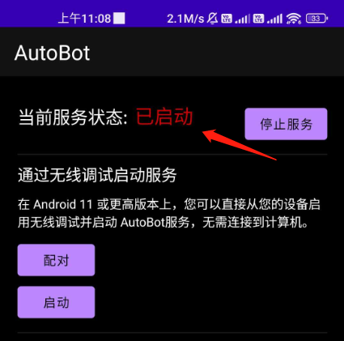

# 激活原理

激活的原理本质上是在 shell 模式下运行一个 server 端，普通应用程序的权限太低，无法调用系统功能。因此需要在 adb shell 或者在 root shell 权限下运行服务端

## Android 设备系统要求

准备一台 Android 系统版本`7-13`的手机（android7.0 以下的设备可尝试）

## 1，安装「autobot.apk」客户端

无论你以何种方式激活，都建议你安装 autobot 应用程序

- [点击下载最新版本的 APK](./download.md ":target=_blank")

## 2，开启设备的 USB 调试功能

- 大部分手机都是进入`设置->版本号->连续点击`，就可以打开 USB 调试
- `不同手机开启USB调试可能不一样`,你可以根据设备型号自行通过搜索引擎查找如何开启 USB 调试

`注意：`
如果软件部分功能（或 API 调用）不正常，请检查以下选项是否在 usb 调试界面开启，不同手机菜单选项不一样，请找类似的选项：

- usb 调试 （未开启的情况下，无法通过 usb shell 运行服务端，若以 root shell 运行，你完全可以跳过这部分）
- usb 安装 （未开启的情况下，无法通过页面/接口安装 apk）
- usb 调试（安全设置）[允许通过 usb 调试修改权限，模拟点击] （未开启的情况下，脚本不能模拟点击）
- 启用视图属性检查功能 （未开启的情况下，软件不能试用布局分系功能）
- 开启禁止权限监控（有此选项的请务必勾选）

## 3，通过 autobot 客户端激活

- 方法一：在 Android11 及以上系统版本中，连接 wifi 后可以直接使用客户端激活，无需电脑介入，按程序提示操作即可。

  `提示：`配对成功后下次无需再次配对，直接系统内开启无线调试后，回到软件页面点击启动即可。

- 方法二：在 android7-13 系统中，可以通过连接数据线手动开启 wifi adb，`开启后直接点击软件界面的启动按钮`即可（此方法无需配对，也是通用的方法，因此当你出现任何问题时都可以尝试此方法）。

  开启命令为（`注意:`此方法需配置 adb 环境变量，可自行通过搜索引擎查找方法）：

```shell
adb tcpip 5555
```

- TV/平板（只有开启 adb 的选项）

  此类设备也最为简单，只需要打开 adb，直接点击软件界面上的系统启动按钮即可，无需配对。

### 常见问题

- 使用方法一配对成功后，点击启动无反应？

  请关闭 usb 调试重新打开，然后重启设备，重新连接 wifi 后打开无线调试，直接回到软件界面点击启动

## 手动激活

手动激活和 rom 集成可以私下联系我，发资料

## 服务启动成功

如何确认服务是否激活成功？

- autobot 应用确认



- 通过 ip 地址和端口确认

  - 打开 android 设备浏览器，输入 `http://127.0.0.1:18080`,页面成功相应

    

  - 电脑确认，android 设备连接 wifi 情况下，可以使用设备在局域网内 ip+端口访问（你需要获取你真实的手机 ip）

    示例：`http://192.168.7.119:18080`

    若出现上边一样的界面代表服务成功激活

  `提示：切换到应用我的页面可以查看设备ip`

  
