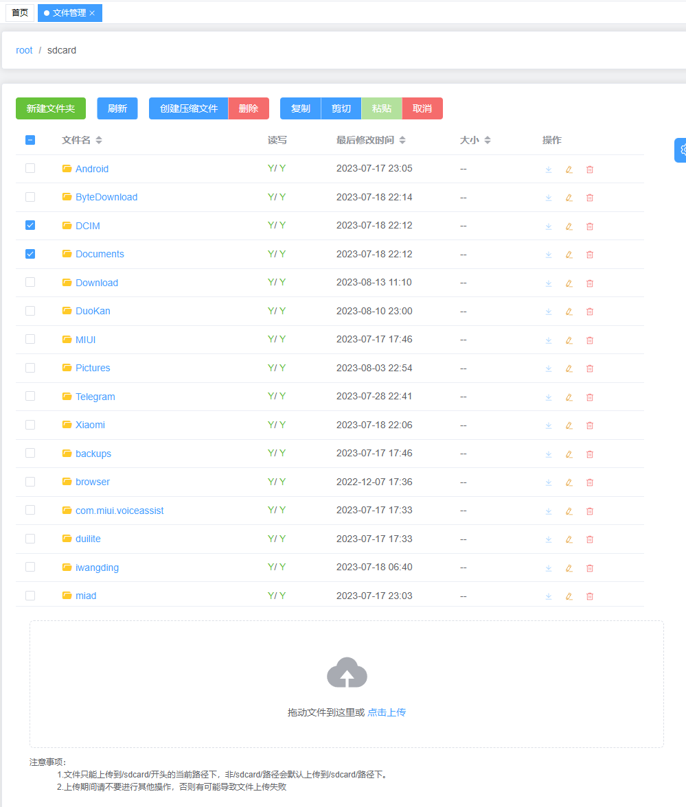

在客户端服务运行成功后，我们将获得服务的地址，如图


我们直接访问对应的连接地址如：`http://192.168.7.119:18080/`，就可以得到下边开箱即用的图形界面

## 开箱即用的图形界面

- 投屏控制
- 支持中英文切换


- 文件管理



- 布局分析


- 应用管理


- 联系人管理


## 调用 HttpApi

在客户端服务运行成功后，我们将获得服务的地址，如图


- 我们可以直接发起 http 请求，比如我们要获取屏幕信息：

```javascript
import axios from "axios";

const options = {
  method: "GET",
  url: "http://192.168.7.119:18080/api/screenInfo",
};

axios
  .request(options)
  .then(function (response) {
    console.log(response.data);
  })
  .catch(function (error) {
    console.error(error);
  });
```

调用其他功能请查看[接口文档](./Api.md)

## 调用 websocket

以下只是示例代码

```javascript
const ws = new WebSocket("ws://192.168.7.119:18080/api/screen");

let heartbeatInterval = 0;
function sendHeartbeatPacket() {
  heartbeatInterval = setInterval(() => {
    ws.send("");
  }, 3000);
}

ws.onopen = () => {
  console.log("connected");
  sendHeartbeatPacket();
  ws.send(
    JSON.stringify({
      action: 103,
    })
  );
};
ws.onclose = () => {
  clearInterval(heartbeatInterval);
  console.log("closed");
};

ws.onmessage = (event) => {
  if (typeof event.data == "string") {
    console.log("接收到文本数据", event.data);
  } else {
    console.log("接收到屏幕帧", event.data);
  }
};
```
