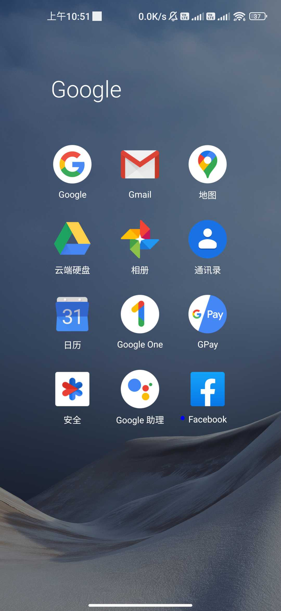

## 介绍

websocket 是即时双向通信协议实时性更高，所以如果你流畅的体验，请你详细阅读此文档。

## 它可以做什么？

- 投屏控制（实时屏幕 jpg 图像流，实时触摸文本输入）
- 通知监听
- 剪切板监听

## ws 连接地址

```
ws://[ip]:18080/api/screen
```

## 发送信息

- 发送信息分为
  - 发送输入控制信息
    - 发送触摸事件
    - 发送输入文本事件
    - 发送输入字符事件
    - 发送输入按键事件
  - 发送屏幕图像控制信息
    - 修改图像缩放，帧率，画质
    - 开始发送屏幕 jpg 帧
    - 停止发送屏幕帧
    - 被动式获取屏幕帧

### 发送输入控制信息

`备注：发送信息目前都是 json 格式的文本信息`

| action | 含义             | 备注 |
| ------ | ---------------- | ---- |
| 1      | 发送触摸事件     |
| 2      | 发送输入文本事件 |
| 3      | 发送输入字符事件 |
| 4      | 发送输入按键事件 |

#### 发送触摸事件

| touch_event | 含义 |
| ----------- | ---- |
| 0           | 按下 |
| 2           | 移动 |
| 1           | 抬起 |

`一个标准的触摸事件一般是先发送按下事件，然后发送多次移动事件，最后在发送抬起事件`

- 按下事件

```
{
    "action": 1,
    "touch_event": 0,
    "x": 100,
    "y": 100,
}
```

- 移动事件

```
{
    "action": 1,
    "touch_event": 2,
    "x": 120,
    "y": 120,
}
```

- 抬起事件

```
{
    "action": 1,
    "touch_event": 1,
    "x": 120,
    "y": 120,
}
```

#### 发送输入文本事件（支持多种语言）

```
{
    "action": 2,
    "value": "hello world你好",
}
```

#### 发送输入字符事件（支持 ACSII 字符）

```
{
    "action": 3,
    "value": "hello world",
}
```

为什么要支持 acsii 字符?

`比如在锁屏界面输入数字解锁屏幕，使用上边的文本无法进行输入，这是我们可以使用 acsii 字符，底层会转换成对应的按键码进行输入`

#### 发送输入按键事件

- value 代表对应的 keyCode，具体可以参考 android sdk KeyEvent.java
- 比如空格键 SPACE 的按键码为 62，退格键 BACKSPACE 的按键码为 67

```
{
    "action": 4,
    "value": 62,
}
```

### 发送屏幕图像控制信息

| action | 含义                     | 备注 |
| ------ | ------------------------ | ---- |
| 102    | 修改图像缩放，帧率，画质 |
| 100    | 开始发送屏幕 jpg 帧      |
| 101    | 停止发送屏幕帧           |
| 103    | 被动式获取屏幕帧         |

#### 修改图像缩放，帧率，画质

- 参数解释

| 参数    | 含义                              | 默认值 | 备注                                                                                                           |
| ------- | --------------------------------- | ------ | -------------------------------------------------------------------------------------------------------------- |
| scale   | 图像缩放，取值范围 0.3-1.0        | 1.0    | 如果屏幕的分辨率为 1280x720，scale 取 0.5，那么缩放后的图像尺寸为 640x360                                      |
| quality | 图像质量，取值范围为 10-100       | 50     | 屏幕图像压缩成为 jpg 的质量，取值越大图像越清晰                                                                |
| fps     | jpg 帧发送间隔，单位为 ms（毫秒） | 50     | 多少毫秒内向客户端发送一次屏幕 jpg 帧，默认值为 50ms，那么真实的 fps 为 20fps，实际情况的 fps 也受网络状况影响 |

```json
{
  "action": 102,
  "scale": 1.0,
  "quality": 50,
  "fps": 50
}
```

#### 开始发送屏幕 jpg 帧

```json
{
  "action": 100
}
```

#### 停止发送屏幕帧

```json
{
  "action": 101
}
```

#### 被动式获取屏幕帧

提示：`在弱网环境下，服务端向客户端推动屏幕jpg流会有较大的延迟`，被动式获取屏幕 jpg 帧，是你发送一次该事件，它会返回一帧 jpg 图像，图像延迟将会降低，实时性会有所提高。

`注意:由于是被动式获取，所以发送和停止决定权在客户端，`因此你无需调用开始发送屏幕 jpg 帧和停止发送屏幕帧

```json
{
  "action": 103
}
```

## 接收信息

- 文本信息

| action | 含义                                       |
| ------ | ------------------------------------------ |
| 1      | 屏幕发生改变信息，屏幕旋转会通知此类型消息 |
| 2      | 代表接收到新的通知信息                     |
| 3      | 代表接收到新的剪贴板发生改变的信息         |

- 二进制信息

  - 为屏幕实时的 jpg 图像流

### 文本信息

#### 屏幕发生改变的信息

```json
{
  "action": 1,
  "value": {
    "height": 1920,
    "width": 1080,
    "rotation": 0
  }
}
```

#### 接收到新的通知

通知信息一般都包含发起通知的包名，通知标题，通知内容，还有一些额外的信息，你都可以获取

```json
{
  "action": 2,
  "value": {
    "notification_package": "com.xxx.xxx",
    "notification_title": "通知标题",
    "notification_content": "hello",
    "intent_packageName": "com.xxx.xxx",
    "intent_shortClassName": ".ui.LauncherUI",
    "intent_uri": "intent:#Intent;launchFlags=0x24000000;component=com.xxx.xxx/.ui.LauncherUI;i.talkerCount=1;S.nofification_type=new_msg_nofification;i.Intro_Bottle_unread_count=0;B.MainUI_FromFinderNotification=false;S.MainUI_User_Last_Msg_BgNotify_From=initIntent;i.MainUI_User_Last_Msg_Type=1;B.Intro_Is_Muti_Talker=false;S.Main_User=xxxxx;end",
    "notification_extras_source_bundle": {
      "android.title": "通知标题",
      "android.reduced.images": true,
      "android.subText": null,
      "android.showChronometer": false,
      "android.text": "hello",
      "android.progress": 0,
      "android.progressMax": 0,
      "android.showWhen": true,
      "android.infoText": null,
      "android.progressIndeterminate": false,
      "android.remoteInputHistory": null
    },
    "notification_intent_source_bundle": {
      "talkerCount": 1,
      "nofification_type": "new_msg_nofification",
      "Intro_Bottle_unread_count": 0,
      "MainUI_FromFinderNotification": false,
      "MainUI_User_Last_Msg_BgNotify_From": "initIntent",
      "MainUI_User_Last_Msg_Type": 1,
      "Intro_Is_Muti_Talker": false,
      "Main_User": "xxxxx"
    }
  }
}
```

#### 粘贴板内容发生改变

```json
{
  "action": 3,
  "value": "hello world"
}
```

### 二进制信息

目前二进制信息只有一种，那就是 jpg 帧，在浏览器环境内使用 websocket 会相应 blob 数据，在 nodejs 下会相应 ArrayBuffer 数据。

解码后就能得到原始的屏幕图像，比如：



## 体验优化

- ws 连接成功后，便会通知屏幕信息，方便你准备好屏幕控制

```
{
	"action": 1,
	"value": {
		"height": 1920,
		"width": 1080,
		"rotation": 0
	}
}
```

- 在弱网环境下，可以选择被动式的屏幕图像获取

## 常见问题

- 为什么连接成功后，`5 秒后自动中断`？

  这是服务端为了避免资源浪费，设置了读取超时，要保持连接的活跃，需要在 5 秒结束前向服务器发送心跳包

  ```
    setInterval(()=>{
        ws.send("")
    },3000)
  ```
