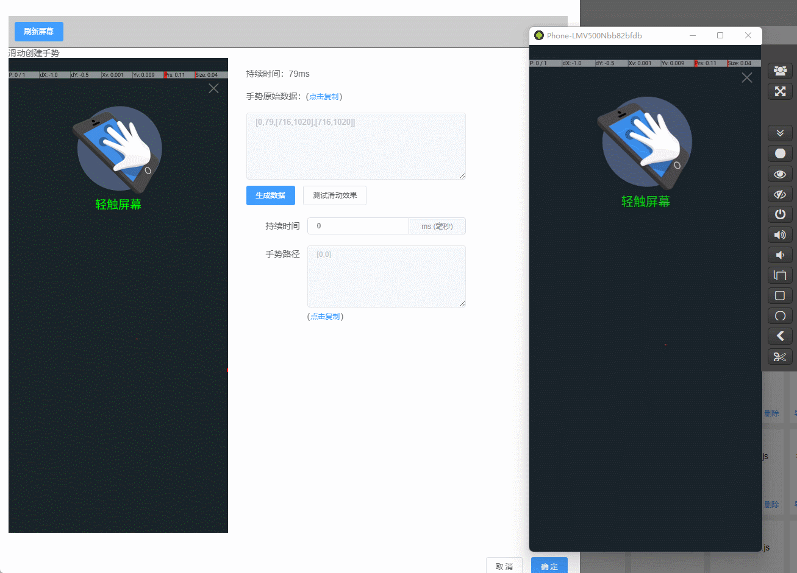
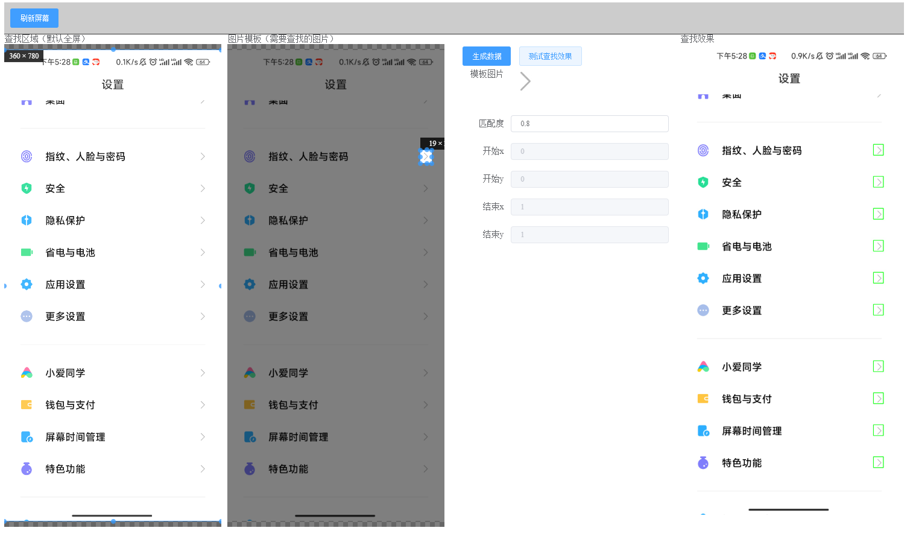
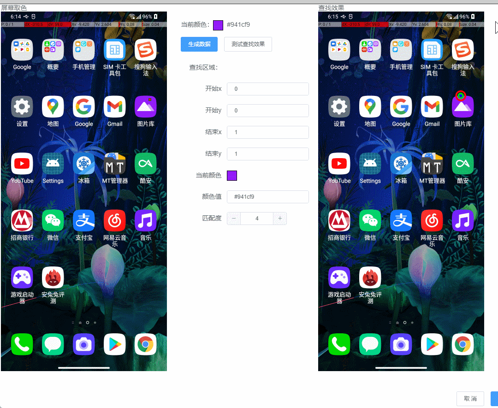
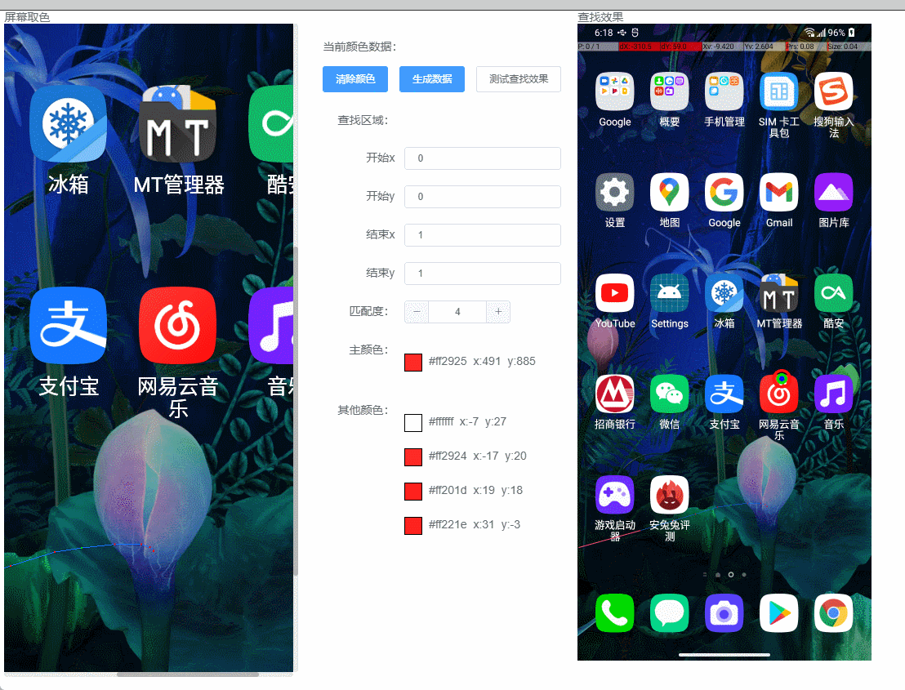
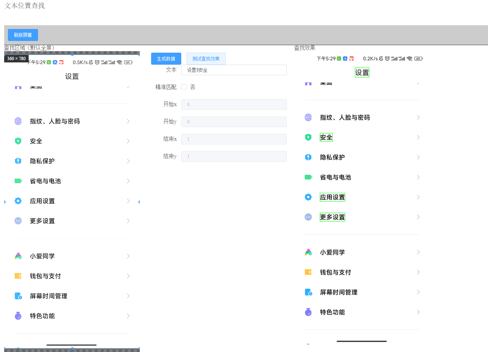
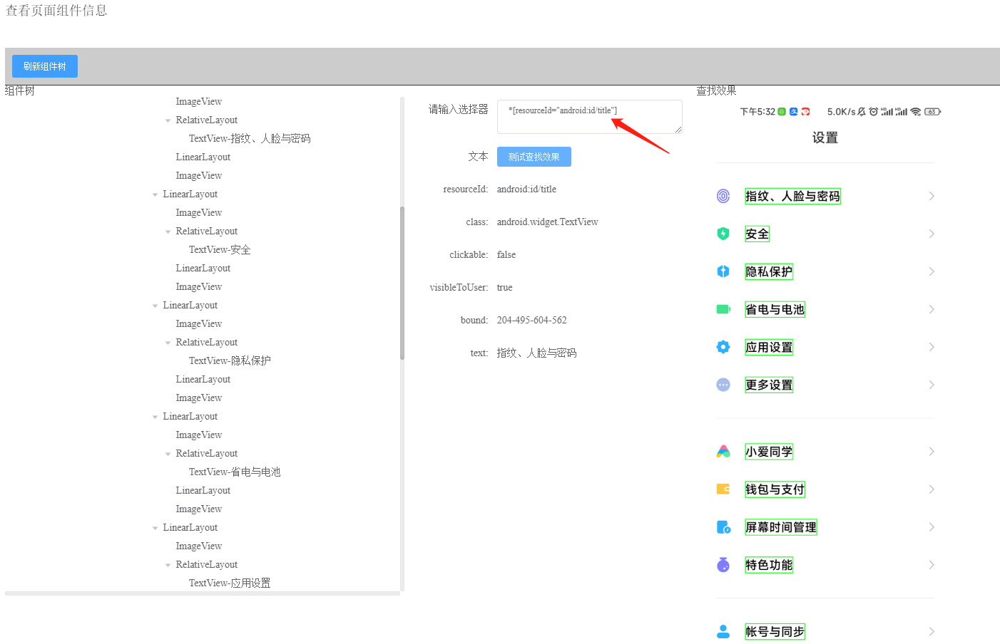
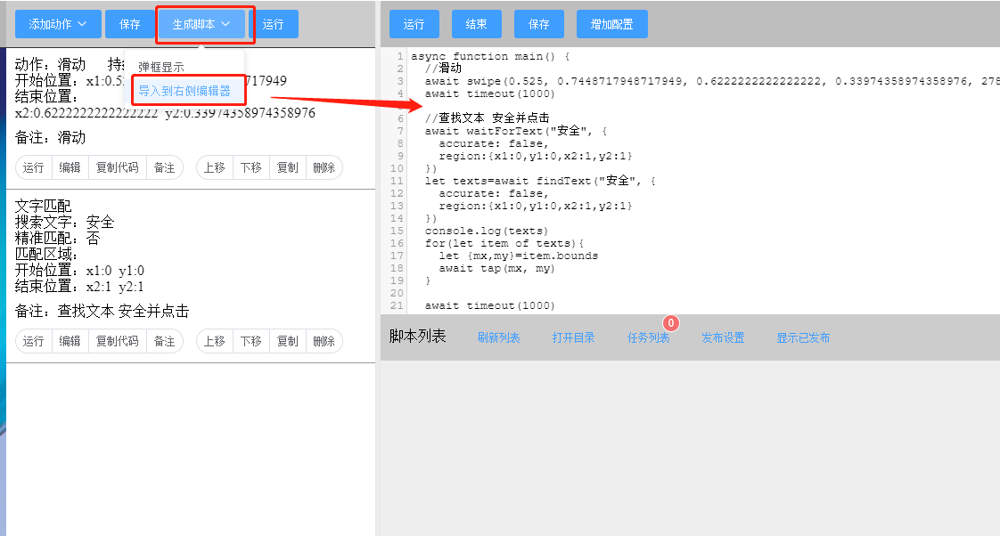
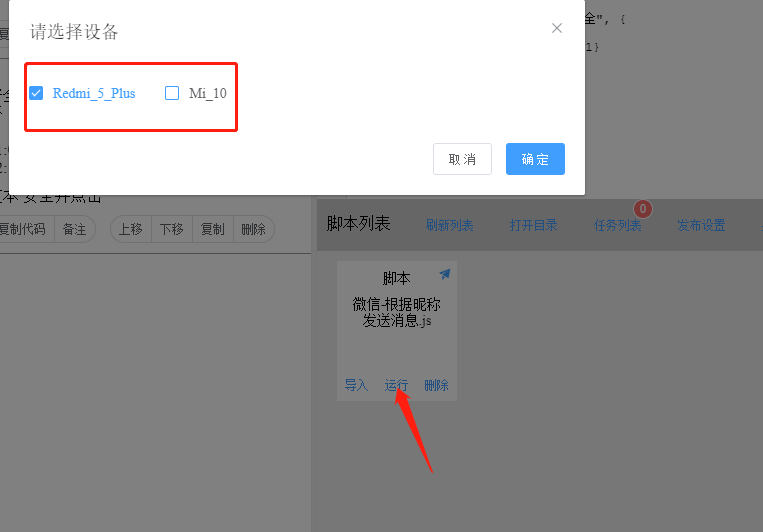

# 快速上手 :id=index

> 10 分钟实现自动看抖音，自动点赞

<iframe src="//player.bilibili.com/player.html?aid=469496103&bvid=BV1T541197MS&cid=729346461&page=1" width="100%" height="720px" allowfullscreen="true"> </iframe>

### 你是否遇到了以下痛点？

1，复杂界面布局难以分析。

2，需要申请无障碍权限，无障碍权限不稳定。

3，写代码不方便，麻烦。

AutoJSPC 统统解决了。

### AutoJSPC 版和同行比有什么优势？

无需开启无障碍权限，无需安装输入法；支持图形化操作，一键生成代码（支持 autox.js），使用非无障碍运行。

### AutoJS PC 版是什么？

是一个让开发者在极短时间内、以最小成本实现各种 APP 辅助（自动化）功能，且帮自己赚米的自动化平台

### AutoJS PC 版能干什么？

简单快速创建自动化测试、智能辅助、效率工具、小应用。譬如：自动化测试、自动化运营、批量处理、机器人、自动回复、抓取 APP 数据、自动签到等等

### 为何选择 AutoJS PC 版？

图形化添加动作，一键生成代码，多设备运行。简单、实用的 js 版 api，丰富的 NodeJS 生态

### AutoJsPC 版亮点

##### 强大的图形化辅助功能,一键添加动作

#### 模拟真人手势，支持多指滑动

##### 便捷的图片查找（模板匹配），快速定位坐标

##### 多色定位，单色定位

##### 多文本匹配，快速定位坐标

##### 内置显示 Android View 树，JQuery 语法快速定位元素

##### 一键代码生成，辅助写代码

##### 一键多设备运行

