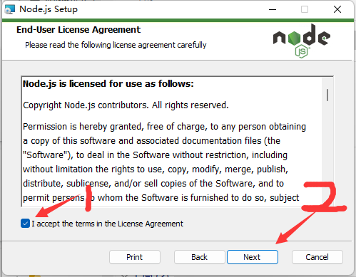
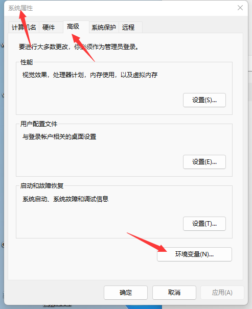
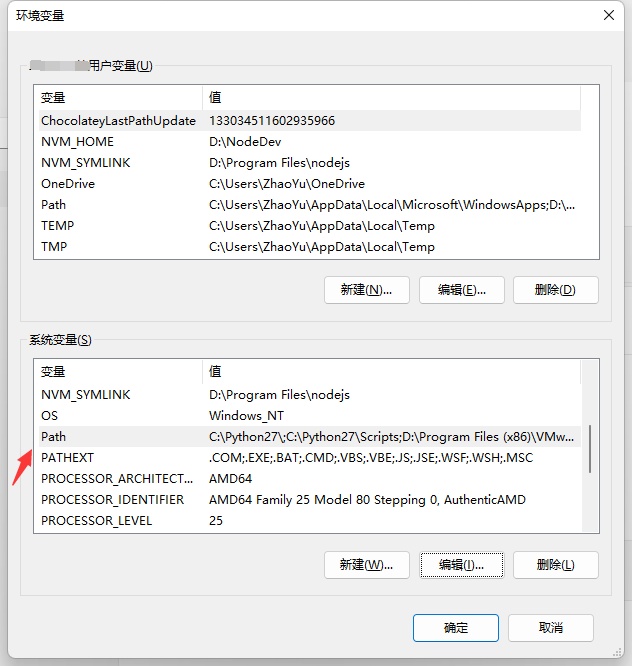
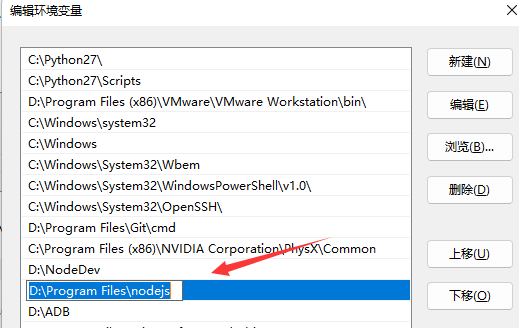

#### 在本章，我们将快速的学习JavaScript基础课程和AutoJS PC的自动化脚本的编写
`本课程由AutoJS PC版出品，未经授权，禁止转载`

# 环境搭建
## 下载安装VSCode

下载地址：[https://code.visualstudio.com/Download](https://code.visualstudio.com/Download)
傻瓜化安装

安装后，可以在插件商店，搜索安装一下`简体中文，JavaScript (ES6) code snippets，Nodejs Snippets`

## 下载nodejs
下载地址：[https://registry.npmmirror.com/-/binary/node/latest-v14.x/node-v14.18.2-x64.msi](https://registry.npmmirror.com/-/binary/node/latest-v14.x/node-v14.18.2-x64.msi)

## 安装nodejs

按照提示下一步



## 检查是否安装成功
```shell
node -v
//v14.19.1
npm -v
//6.14.16
```
注意：如果上述命令不可用，需要手动添加系统环境变量，可以参考下边的步骤

## 添加系统环境变量
1，桌面，右键此电脑->属性（部分系统需要点击高级系统设置）->打开系统属性->高级->环境变量




2，在环境变量->系统变量找到PATH->编辑



3，添加（nodejs安装根目录）
比如，我这里安装在`D:\Program Files\nodejs`



点击确定后，重启电脑

## 使用国内镜像源
安装nrm 
```shell
npm i -g nrm
```
显示可用源
```shell
nrm ls
//output
  npm ---------- https://registry.npmjs.org/
  yarn --------- https://registry.yarnpkg.com/
  tencent ------ https://mirrors.cloud.tencent.com/npm/
  cnpm --------- https://r.cnpmjs.org/
  taobao ------- https://registry.npmmirror.com/
  npmMirror ---- https://skimdb.npmjs.com/registry/
```
使用淘宝/腾讯(任选其一即可)
```shell
nrm use taobao

nrm use tentcent
```

# 变量定义
在本章我们讲解常见的数据类型
## 值类型

String、Number、Boolean、Null和Undefind

```js
//const let var 区别
//定义string变量
let str="hello world"
let str2='张三'
let str3=`李四`
//定义number变量
let num=1
let num2=0.1
let num3=-0.1
//null和undefind
let obj=null
let obj2//默认是undefined

//定义boolean
let b1=true  //true
let b2=false //false
let b3=1    //true
let b4=0    //false
let b5=""   //false
let b6="1234" //true
let b7=null   //false
let b8=undefined //false
let b9=[]     //true
let b10={}     //true
let b11=1<2     //true
let b12=1>2     //false
let b13=1+3>2     //true
```
## 引用类型
Object、Array、Function、Date

//定义一个对象
```js
let obj={
    name:"张三",
    age:12,
    isNan:true,
    show:function (){
        console.log(`姓名：${this.name}年龄：${this.age}`)
    }
}
console.log(obj.name)
console.log(obj.age)
obj.show()
```
// class

//定义数组
```js
var arr=[]
var arr2=[1, 2, 3.14, 'Hello', null, true]
```

//获取当前的日期
```js
let date=new Date() //返回当前日期对象
date.getFullYear()//年
date.getMonth()//月(0-11)需要+1
date.getDate() //日
date.getHours() //小时
date.getMinutes()//分
data.getSeconds() //秒
data.getDay() //星期（0-6）0 代表星期日
data.getTime() //获取时间戳
```

## 运算符
一元操作符：++ -- += -=
```js
let i=10
i++
++i
i--
--i
i+=2
i-=2
```
布尔操作符：! 取反
```js
let b=!false
console.log(b) //true
```
运算符：+-*/
```js
let i=0
i=i+2
i=i-2
i=i*2
i=i/2
i=i+"2"
```
关系操作符：> < >= <= == ===
```js
let a=2
let b=3
console.log(a>b)
console.log(a<b)
console.log(a>=b)
console.log(a<=b)
console.log(a==b)
console.log(a===b)
```

# 方法定义

## 标准定义
```js
function show() {
    console.log("show")
}
show()

let show2=function (){
    console.log("show2")
}
show2()
```
## 传递参数

```
//传递参数
let showPara=function (a,b){
    console.log(`a=${a},b=${b}`)
    return a+b
}
let a=0
let b=0
showPara(a,b)

//默认参数
let add=function (a=1,b=2){
    return a+b
}
console.log(add()) //3
console.log(add(3,4)) //7
```
## 值传递和引用传递

```
//值传递和引用传递
let changeAb=function (a,b){
    a=1
    b=2
    console.log(`a=${a},b=${b}`)
}
let a=0
let b=0
changeAb(a,b)
console.log(`a=${a},b=${b}`)//0,0
//思考,为什么没有发生改变，如果想要改变外部a,b的值需要怎么操作

```

## 箭头函数

箭头函数和普通函数有作用域的问题，想要学习更深入的可以自行学习

```
let show3=()=>{
    console.log("show3")    
}
show3()
let showPara=(a,b)=>{
    console.log("show3")
}
showPara(a,b)
```
还有匿名函数，自执行函数等...


# 流程控制

## if-else
```js
let user={
    name:'张三',
    age:18
}
if(user.age>18){
    console.log("成年")
}else{
    console.log("未成年")
}
```
## if-elseif-else
```js

function getStage(age){
    if(age<12){
        return "少年"
    }else if(age<18){
        return "青年"
    }else{
        return "成年"
    }
}
console.log(getStage(18))
```
## switch
```js
function doSomething(stage){
    switch (jieDuan) {
        case '少年':
            console.log("好好享受童年吧")
        case '青年':
            console.log("好好读书，考个好大学")
        case '成年':
            console.log("赶紧找个女朋友")
    }
}
let age=18
let stage=getStage(age);
doSomething(stage)
```
# 循环

## for循环
```js
for (let i=0;i<10;i++){
    console.log(i)
}
for (let i=1;i<=10;){
    i++
    console.log(i)
}
for (let i=10;i>0;i--){
    console.log(i)
}
//使用for循环遍历数组
let arr=['a','b','c']
//使用数组下表遍历
for (let i=0;i<arr.length;i++){
    console.log(arr[i])
}
//in遍历，index表示key,可以遍历（数组，对象）
for (let index in arr){
    console.log(index)
    console.log(arr[index])
}

var obj={name:"zhangsan",age:12,sex:"男"}
for(let key in obj){
    console.log(key)
    console.log(obj[key])
}
//of遍历，直接返回数组的元素，不能遍历对象
for(let item of arr){
    console.log(item)
}

```
## while循环
```js
let age=0
while (age<18){
    age++
    console.log(`我年龄${age},还未成年，你不能抓我哦`)
}
console.log("成年了")
```

## 死循环
```js
for(;;){
    console.log("死循环了")
}
while (true){
    console.log("死循环了")
}
```

## 跳出循环

```js
for(let i=0;i<18;i++){
    if(i==12){
        break
    }
}

let age=0
while (true){
    age++
    if(age>18){
        break
    }
}
```

# 字符串操作

## 连接字符串

```js
//连接符
let a="hello"
let b="world"
let c=a+b
console.log(c)
let d=c+"你好，世界"+"。"
console.log(d)
//使用``
let a='hello'
let b="world"
console.log(`${a}-${b}`) //hello-world
```

## 字符串常用方法

```js
//字符串常用方法
let a="hello world"
//裁剪字符串
a.substr(0,4)
a.substring(0,4)
//是否以hello开始
a.startsWith("hello")
//是否以world结束
a.endsWith("world")
"xxx.avi".endsWith("avi")
//返回字符出现的下表
a.indexOf("h")
a.indexOf("z")
//去除空格
aa="  1234   "
aa.trim() //1234
//替换字符
aa.replace(" ","")
aa.replaceAll(" ","")
```
# 正则使用

正则常用作字符串校验，字符串分割，替换，提取关键信息等领域。功能`非常非常非常`强大

## 判断字符串是否符合某个规则

```js
let emailRegx=/^([A-Za-z0-9_\-\.\u4e00-\u9fa5])+\@([A-Za-z0-9_\-\.])+\.([A-Za-z]{2,8})$/
emailRegx.test("aa@qq.com")
let phoneRegx=/^1(3|4|5|6|7|8|9)\d{9}$/
phoneRegx.test("13312341234")
```

## 字符串替换

```js
let name="     zhang   san "
name.replace(/\s/i,"")
let names=["zhangsan@qq.com","lisi@163.com"]
let results=[]
for(let item in names){
   let result= item.replace(/(.*)@.*/i,"$1@baidu.com")
    results.push(result)
}
console.log(results)
```
想要灵活的掌握正则不是一件易事，也不是一两句话就能讲清楚的，大家可以从其他渠道自行学习研究。
学习正则就跟考驾照一样，考过了觉得很简单，考不过的人觉得很复杂。

# 数组操作

```js
let arr=['a','b','c','d']
arr.length //数组长度
arr[0]="e" //修改数组第0个元素
arr.indexOf("b") //返回元素在数组中的下标
arr.slice(0,2) //返回一个新的数组,不会对原数组做操作，['a','b']
//从数组的尾部操作，影响原始数组
arr.push("e") //从数组尾部添加元素
arr.pop() //从数组尾部删除
//从数组的头部操作
arr.unshift(1,2) //从头部添加元素
arr.shift() //从头部删除元素，并且返回这个元素

let arr=[2,7,5,3,1]
arr.sort() //排序
//支持自定义比较器,其他的比较器需要自己研究
arr.sort((a,b)=>{
    if(a==b){
        return 0
    }else if(a>b){
        return -1
    }else{
        return 1
    }
    return a==b?0:a>b?-1:1
})
let arr=[{name:'zhangsan',age:12},{name:'lisi',age:7},{name:'wanger',age:13}]
arr.sort((a,b)=>{
    return a.age==b.age?0:a.age>b.age?-1:1
})
//数组反转
let arr=['a','b','c','d']
arr.reverse()
//数组连接
let arr=['a','b','c','d']
let arr2=['e','f']
let arr3=arr.concat(arr2)
console.log(arr3)
//新的连接方式
let arr4=[...arr,...arr2]
console.log(arr4)
arr.push(...arr2)
console.log(arr)
//join 连接
let arr=['a','b','c','d']
arr.join("-")
```
# 解构赋值

## 数组解构

```js
let arr=[1,2,3,4]

//传统方式，如果我们想要访问第下标为0，1，2的并且赋值给a,b,c这3个变量
let a=arr[0]
let b=arr[1]
let c=arr[2]

//现在你可以这么写了
let [a,b,c]=[1,2,3,4]

```

## 对象解构

```js
let obj={
    name:"张三",
    age:12
}

//传统方式，如果我们想要访问第下标为0，1，2的并且赋值给a,b,c这3个变量
let name=obj.name
let age=obj.age

//现在你可以这么写了
let {name,age}=obj

```

解构还支持`默认值，重命名变量名`等操作，可以到阮一峰es6文档学习查看

# async await用法

## 异步回调地域问题

```js
//回调地域代码
$.get("test.php", { name: "John", time: "2pm" },
    function(data){
        $.get("test2.php", { name: "John", time: "2pm" },
            function(data){
                alert("Data Loaded: " + data);
            }
        )
    }
);

setTimeout(function (){
    console.log("1")
    setTimeout(function (){
        console.log("2")
        setTimeout(function (){
            console.log("3")
        },2000)
    },2000)
},2000)

```

## async await解决

```js
function timeout(timeout=2000){
    return new Promise((resolve,reject)=>{
        setTimeout(function (){
            resolve
        },timeout)
    })
}

async function main(){
    await timeout(2000)
    console.log("dosomething..")
    await timeout(3000)
    console.log("dosomething2..")
}
//示例代码，真实请求中用的是axios，
function get(url,params){
    return new Promise((resolve,reject)=>{
        $.ajax({
            type: "GET",
            url: url,
            data: params,
            success: function(data){
                resolve(data)
            }
        });
    })
}

async function main(){
    const data=await get("xxx.php","a=3&b=3")
    console.log(data)
    const data2=await get("xxx2.php",`a=${data.b}`)
    console.log(data2)
}

```

# 模块

## 导出单个方法
hello.js （导出模块）
```js
function hello() { 
  console.log("hello world")
};
module.exports = Hello;
```

main.js （使用模块）
```js
const hello=require('./hello.js')
hello()
```
## 导出多个方法，变量
hello2.js
```js
const name="zhangsan"
function hello() { 
  console.log("hello world")
};

function hello2() {
    console.log("hello world2")
};
module.exports = {
    name,
    hello,
    hello2
};
```
main.js
```js
const {hello,hello2,name}=require('./hello.js')
hello()
hello2()
console.log(name)
```

`注意：AutoJS PC版的内部nodejs版本，不支持es6模块系统`

所以下边的这种语法暂不支持
```js
import xxx from 'xxx'

export {
    xxx
}
```

# 学习推荐

在线教程：

[廖雪峰官网Javascript教程](https://www.liaoxuefeng.com/wiki/1022910821149312)

[阮一峰ES6入门](https://es6.ruanyifeng.com/)

书籍：
《JavaScript高级程序设计》
自行去各大电商平台购买
