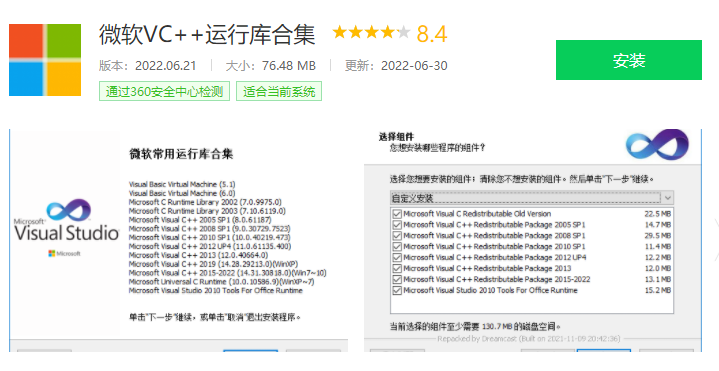

## 需要 root 权限吗？

不需要

## 需要无障碍权限吗？

3.0 以上版本不需要，2.0 版本需要

## 支持 win7 吗？

支持，AutoJSPC 版支持 win7-win11 操作系统

## 支持中文输入吗？

支持，在不需要安装输入法的情况下直接输入中文

## 初次安装，启动报错？

如果你使用的 ghost 版本系统或者非官方系统（精简版系统），可能缺少系统组件，请搜索安装微软常用 VC++运行库合集

## 刷新设备，不能正常显示？

- 确保手机服务已经启动成功
- 检查运行 AutoJS PC 版的电脑和手机是否处于同一个 局域网下
