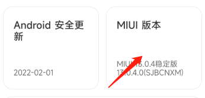
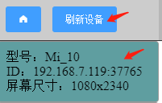

# 准备工作
在正式使用前，请确认是否完成以下几步：

## 1.下载并安装「AutoJS PC」windows端程序
- [点击下载最新版本的AutoJSPC程序](http://autojs.tntok.top:18080/#/download ':target=_blank')

## 2.注册账户
  `注册账户时，请填写真实的电子邮箱，以便后续维护账户，否则有可能导致账户不可用。`

## 3.准备至少一台Android版本7-12的Android手机
  - `开启设备的USB调试功能`
  - 大部分手机都是进入`设置->版本号->连续点击`，就可以打开USB调试
  - 比如我这里的小米手机，连续点击MIUI版本10次就可以打开USB调试

    
  - `不同手机开启USB调试可能不一样`,你可以根据设备型号在百度搜索如何开启USB调试

`注意：`
如果软件部分功能不正常，请检查以下选项是否在usb调试界面开启，不同手机菜单选项不一样，请找类似的选项：
  - usb调试  （未开启的情况下，设备列表不能正常显示设备）
  - usb安装   （未开启的情况下，无法使用脚本安装apk）
  - usb调试（安全设置）[允许通过usb调试修改权限，模拟点击] （未开启的情况下，脚本不能模拟点击）
  - 启用视图属性检查功能   （未开启的情况下，软件不能正确的使用文本查找和选择器查找功能）

oppo的系统需要另外开启：`打开->禁止权限监控`  （未开启的情况下，模拟点击，文本查找，选择器查找等都无法正常使用）

## 4.连接电脑
在手机开启usb调试的情况下，插入数据线，点击PC端软件左侧->刷新设备按钮，在设备列表成功显示设备，代表连接成功



- `注意如果手机弹出是否允许USB调试，一定要点击允许，如果这步出错，请关闭usb调试后重新打开执行上边操作`
- android 11系统以上的手机 USB调试支持无线连接，电脑和手机处于同一网络下可以使用（建议使用数据线连接）
  - 在开发者选项打开无线调试，点击使用配对码配对设备
  - 在cmd运行以下命令
```
    adb pair ip:port
    //输入配对码即可完成配对
    adb connect ip:port
```

## 最新版本无需无障碍，无需客户端
`3.0版本以上不需要安装客户端软件，不需要开启无障碍，请尽快升级最新版本`

