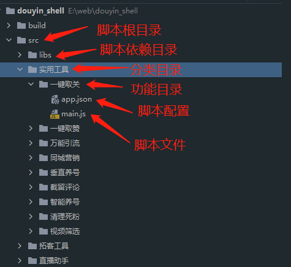
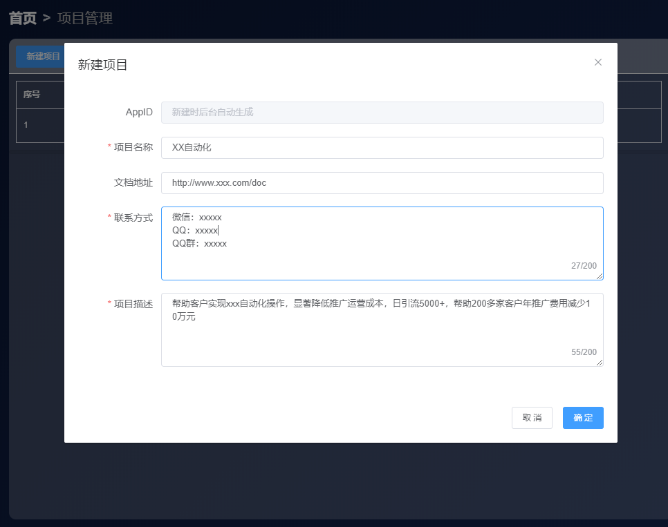
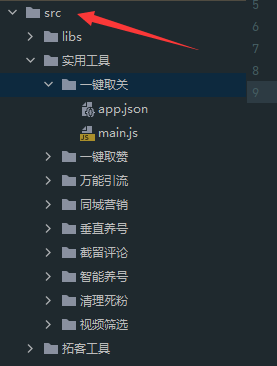
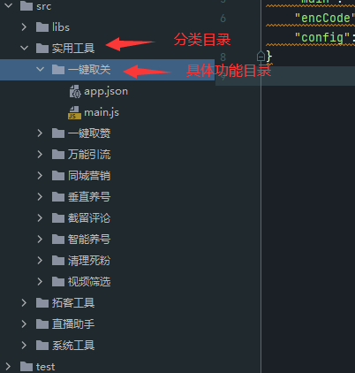
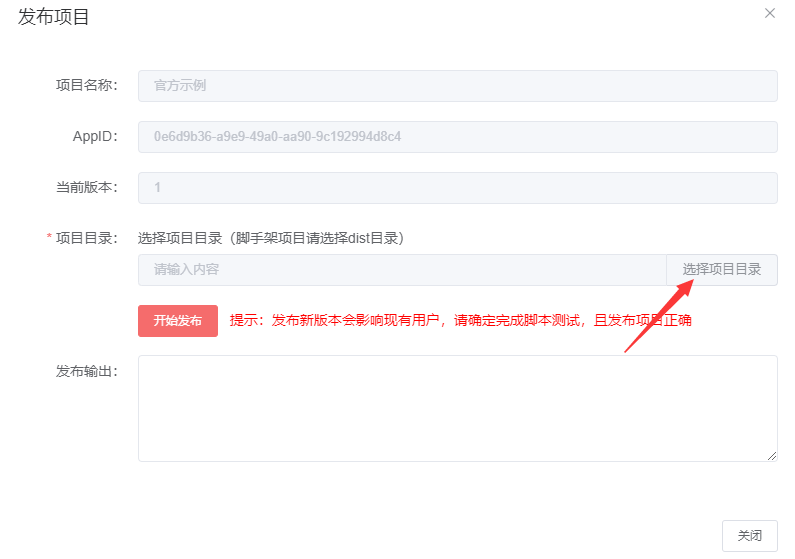
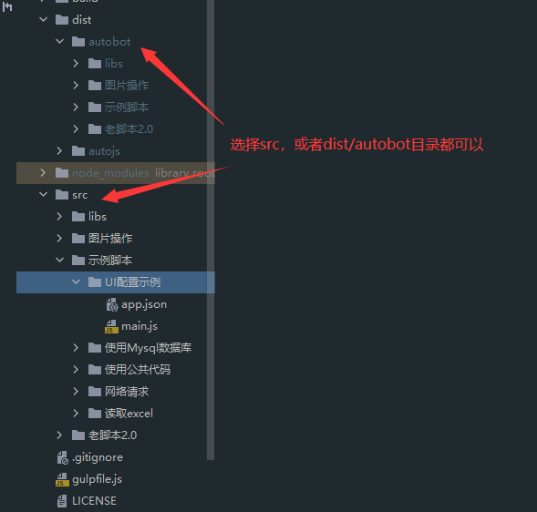
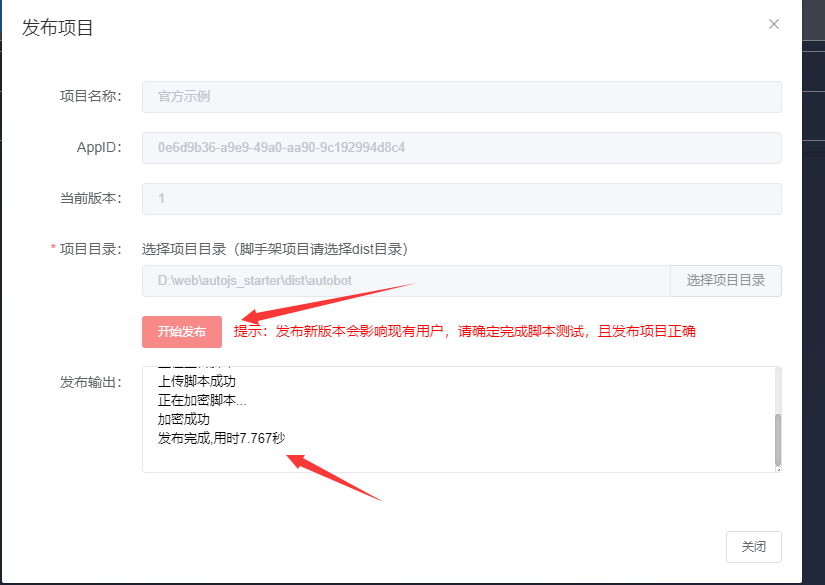

# 请按照下面步骤准备

点击下载[AutoBot客户端最新版本](http://autojs.tntok.top:18080/download/AutoBot%20Setup%204.0.0.exe)

温馨提示：`开发阶段你可以生成开发者测试密钥配合上边的客户端进行测试`

# 一、准备脚本

## 1，在AutoJS编辑器内完成脚本开发
提示：推荐使用`脚手架工具`进行开发,脚手架不仅有脚本目录模板，还支持自动生成到autojs脚本目录，可以时时测试

把脚本按照以下目录格式存放：




## 2，为脚本增加配置文件`app.json`

参数详解：
```json
{
    "name": "脚本名称，如：抖音点赞",
    "desc": "脚本描述，如：在抖音首页运行，可以自动给视频点赞",
    "main": "main.js", //脚本的文件名字
    "config": {
      "配置Key，程序内用来读取配置的字段": {
        "label": "配置界面输入框的标题",
        "type": "配置界面UI组件的类型",
        "value": "当前配置的默认值",
        "unit": "输入框组件，可以支持单位，如分钟，个"
      },
      //例子
      "caozuoJiange": {
        "label": "操作间隔",
        "type": "valuearea",
        "value1": "1",
        "value2": "4",
        "unit": "秒"
      }
      ....
    }
}
```
### 支持UI组件类型

#### 文本输入框

- 参数:
   - 组件类型：text
   - 值：value，支持字符串，数字
   - 单位：unit，如 个，分钟，等

- 参考配置：
```json
"text": {
    "label": "文本框",
    "type": "text",
    "value": "我是文本框",
    "unit": "个"
}
```

#### 开关按钮

- 参数:
  - 组件类型：switch
  - 值：value，支持boolean

- 参考配置：
```json
"switch": {
    "label": "我是开关按钮",
    "type": "switch",
    "value": true
}
```

#### 取值范围

- 参数:
  - 组件类型：valuearea
  - 值：value，支持number（建议）
  - 单位：unit，如 个，分钟，等
 
- 参考配置：
```json
"valueare": {
    "label": "取值范围",
    "type": "valuearea",
    "value1": "5",
    "value2": "30",
    "unit": "秒"
}
```

#### 文本域

- 参数:
    - 组件类型：textarea
    - 值：value，支持\n（换行符）分割多个字符串，数字组合

- 参考配置：

```json
"textarea": {
    "label": "文本域",
    "type": "textarea",
    "value": "我是默认第一行\n我是默认第二行\n我是默认第三行"
}
```

#### 选择文件

- 参数:
    - 组件类型：selectFile
    - 值：value，支持文件路径

- 参考配置：

```json
"selectFile": {
    "label": "选择文件",
    "type": "selectFile",
    "value": "D:/aa.text"
}
```

#### 选择文件夹

- 参数:
    - 组件类型：selectDir
    - 值：value，支持夹路径

- 参考配置：

```json
"selectDir": {
    "label": "选择文件夹",
    "type": "selectDir",
    "value": "D:/xxxdir"
}
```

## 3，在脚本读取配置

#### app.json

```json
{
  "name": "万能引流",
  "desc": "自动推送消息",
  "main": "main.js",
  "config": {
    "yunxingShijian": {
      "label": "运行时间",
      "type": "text",
      "value": "60",
      "unit": "分钟"
    },
    "shipinGuankan": {
      "label": "视频观看",
      "type": "valuearea",
      "value1":"5",
      "value2": "30",
      "unit": "秒"
    },
    "dianzanGailv": {
      "label": "点赞概率",
      "type": "text",
      "value": "30",
      "unit": "%"
    },
    "guanzhuGailv": {
      "label": "关注概率",
      "type": "text",
      "value": "20",
      "unit": "%"
    },
    "pinglunGailv": {
      "label": "评论概率",
      "type": "text",
      "value": "10",
      "unit": "%"
    },
    "pinglunNeirong": {
      "label": "评论内容",
      "type": "textarea",
      "value": "nick非常棒\n这个拍的真不错\n支持 上个热门\n非常不错 支持一个\n希望有更好的作品 非常厉害了\n加油 支持一个\n哇，又刷到你了\n可看到你更新作品了，不容易啊\n原来可以这样玩，学到了\n期待更优秀的你出现\n好巧啊！看看我的作品吧\n感谢缘分让我们相遇、共同学习\n果然评论区都是人才，我是来看评论的\n每天都有关注你更新作品，向你学习，我们一起加油吧\n报团取暖，直播时候我去捧场\n赞一回三\n默默关注你回个呗\n很高兴认识你\n交个朋友吧！\n来我主页看看\n认识你是一种缘分\n你来我往，我先你后\n给你的赞可能回迟到，但从不会缺席\n常来常往，我来看你了，记得来看我哦\n",
      "unit": "%"
    },
    "sixinGailv": {
      "label": "私信概率",
      "type": "text",
      "value": "10",
      "unit": "%"
    },
    "sixinNeirong": {
      "label": "私信内容",
      "type": "textarea",
      "value": "看了你的作品、相当不错\n厉害了\n非常喜欢你的作品\n很认真的作品\n非常喜欢你\n作品非常棒哦，希望能交个朋友\n",
      "unit": ""
    }
  }
}
```

### 脚本中读取配置
注意：运行时，软件会自动读取app.json，并且把配置挂在在全局`globalConfig`变量中

```js
const appConfig=Object.assign({},globalConfig)
//读取运行时间
let yunxingShijian=appConfig.yunxingShijian.value
console.log(`程序将在在${yunxingShijian}分钟后停止`)
//读取视频观看多少秒
let start=appConfig.shipinGuankan.value1
let end=appConfig.shipinGuankan.value2
console.log(`视频观看${start}-${end}秒`)
//读取评论内容，根据换行拆分
const pinglunArr=appConfig.pinglunNeirong.value.split("\n").filter(Boolean)
console.log("评论内容",pinglunArr)
//读取私信内容，根据换行拆分
const sixinArr=appConfig.sixinNeirong.value.split("\n").filter(Boolean)
console.log("私信Arr",sixinArr)

```

# 二、发布脚本

## 脚本案例
点击下载[示例项目（完善中，尽快提供）]()
可以用来发布版本测试。

## 1，创建项目
- 注意：`每个账号拥有20个项目额度`

在autojs功能列表页，选择`项目管理->新建项目`

按照要求填写`项目名称，文档地址，联系方式，项目描述`



## 2，发布脚本
创建完成项目后，点击`发布新版本`

选择脚本目录,要选择脚本根目录



注意：脚本要有功能目录，且功能目录要放在分类目录下



[comment]: <> (下载脚本示例，可以测试)

点击选择脚本目录



选择脚本的根目录，`脚手架项目可以选择src目录，也可以选择dist/autobot目录`



点击开始发布




## 3，生成激活码（需要付费）

注意：`开发阶段你可以自己下载autobot客户端，生成开发者的密钥，来测试项目`

作者寄语：
大家都知道任何一个只靠爱发电的项目是活不长久的，作者在项目上投入了大量的时间精力，服务器域名这些的都是需要花钱购买的。
一套成熟的脚本都是几千起步的，平台只是成本价收费，希望理解。

## 4，把激活码和AutoBot客户端发给客户

注意：`开发阶段你可以自己下载autobot客户端，生成开发者的密钥，来测试项目`

点击下载[AutoBot客户端](http://autojs.tntok.top:18080/download/AutoBot%20Setup%204.0.0.exe)

