# 快速入门
在这章，你能快速了解软件页面及相关操作

## 软件功能区域图

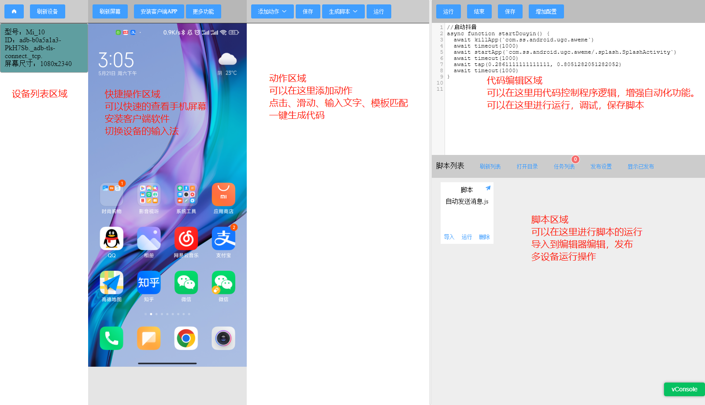

## 添加点击、滑动动作

#### 动画演示


#### 操作步骤

- 点击`添加动作->点击滑动`（添加其他动作同上）


- 在弹出的窗口中，点击你想在手机屏幕上点击的位置，右侧会自动生成坐标

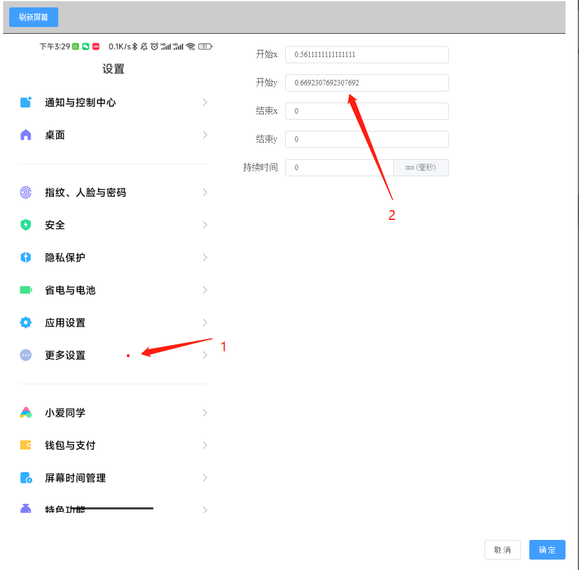

- 点击确定即可完成添加`点击操作`
- 点击运行，可以看到手机对应位置上执行的点击操作，已经进入到了更多设置页面
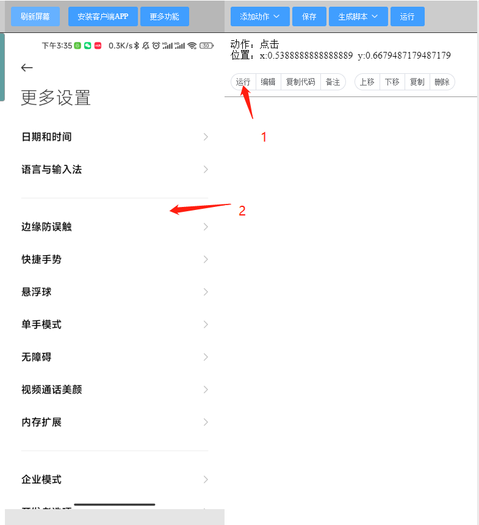

- 滑动同理

 

## 模拟手势

#### 动画演示

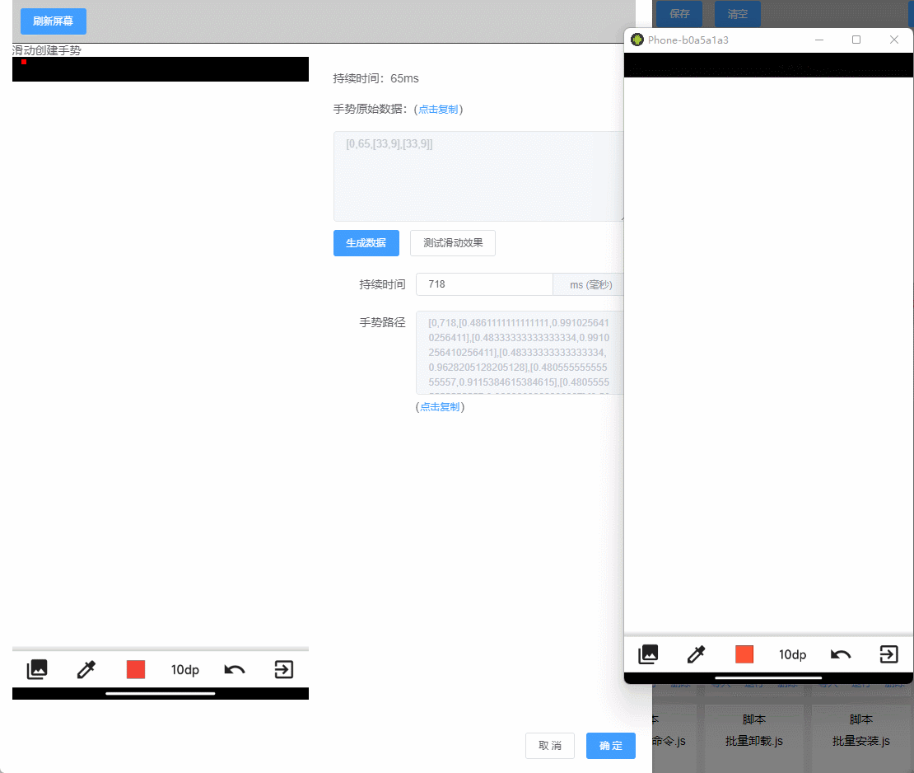

## 输入文字

#### 动画演示

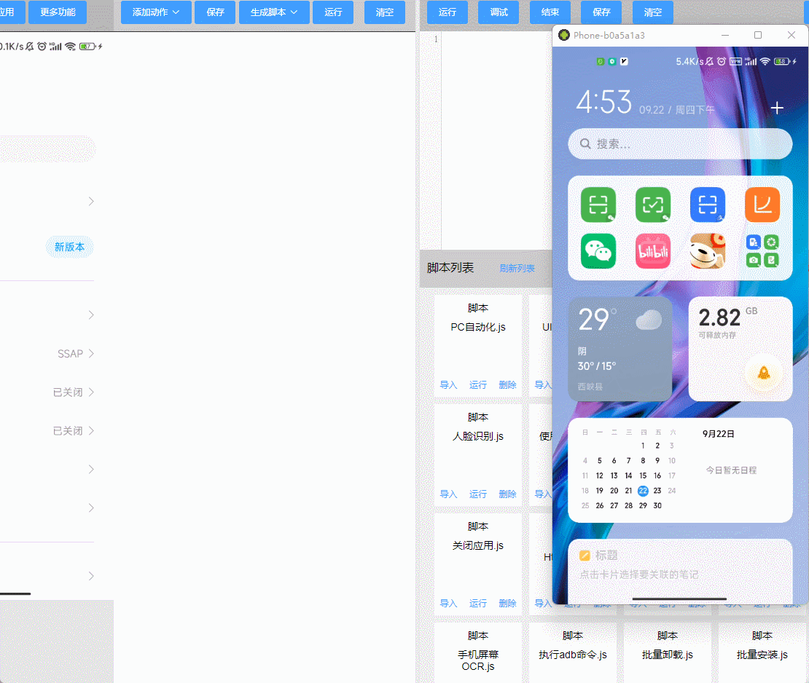

#### 操作步骤

#### 点击`添加动作->输入文字`，在弹框内输入内容，如`hello world`

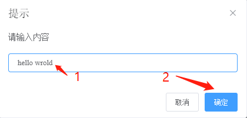

#### 我们在手机上找到一个输入框，点击运行，可以看到文本已经被正确输入

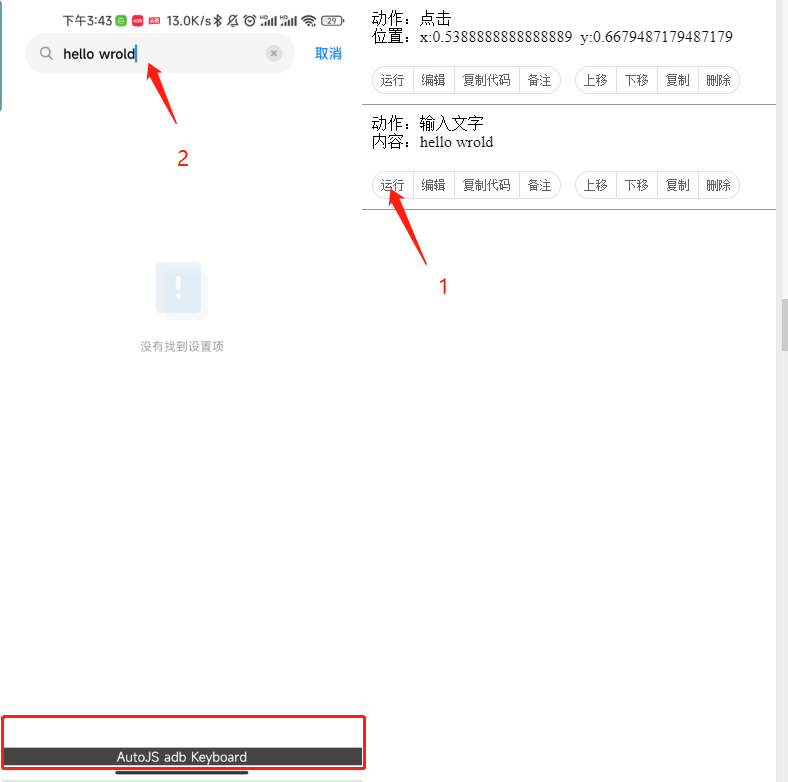

## 时间间隔
- 时间间隔代表一个操作到另一个操作中间要等待多少时间

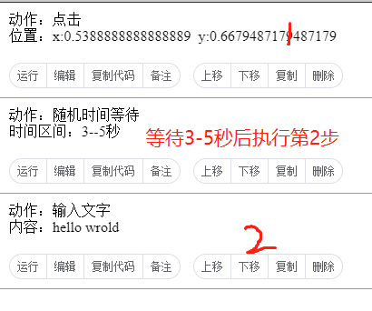

- 比如我们要等待3-5秒，可以这么设置


## 模板匹配（图片查找功能）

#### 动画演示


#### 操作步骤

图片查找功能在一些`不能通过文字或者选择器`定位元素位置时，特别有用

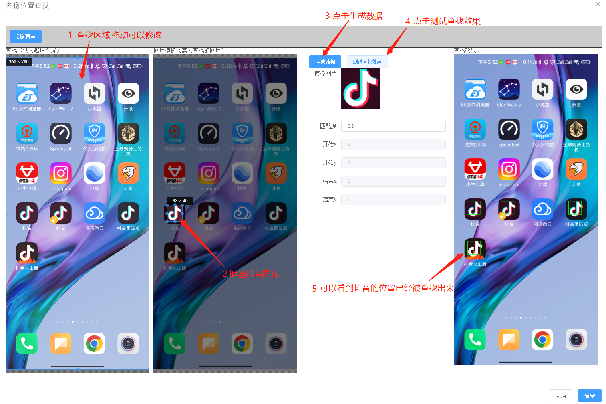

## 单色定位

#### 动画演示

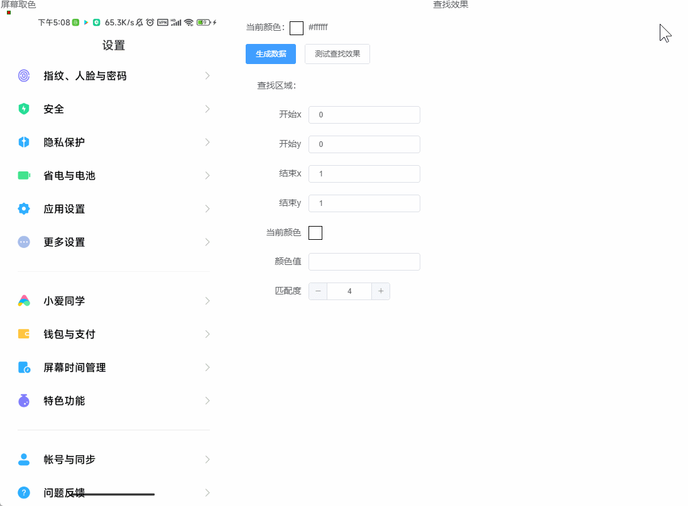


## 多色定位

#### 动画演示

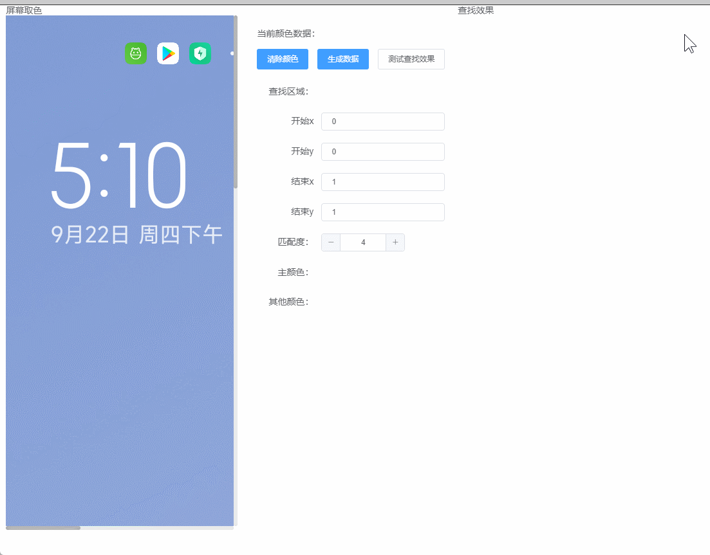


## 文本查找
在一些自动化过程中，有时候我们需要通过文本来定位元素位置，辅助我们的操作

#### 动画演示


#### 操作步骤

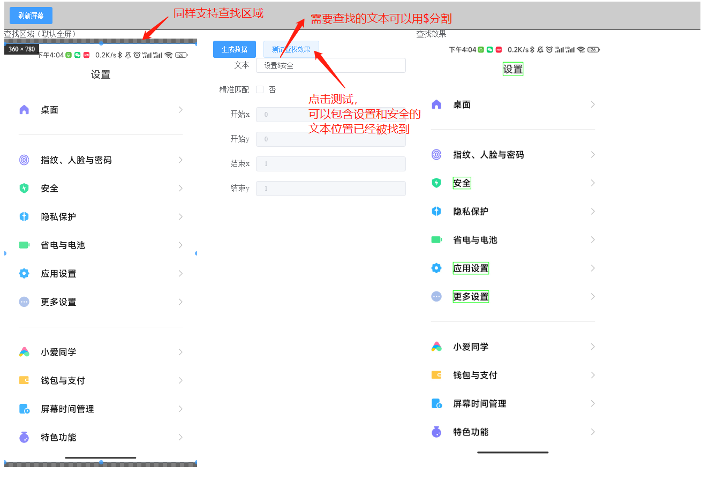

## 选择器查找(高级)

#### 动画演示

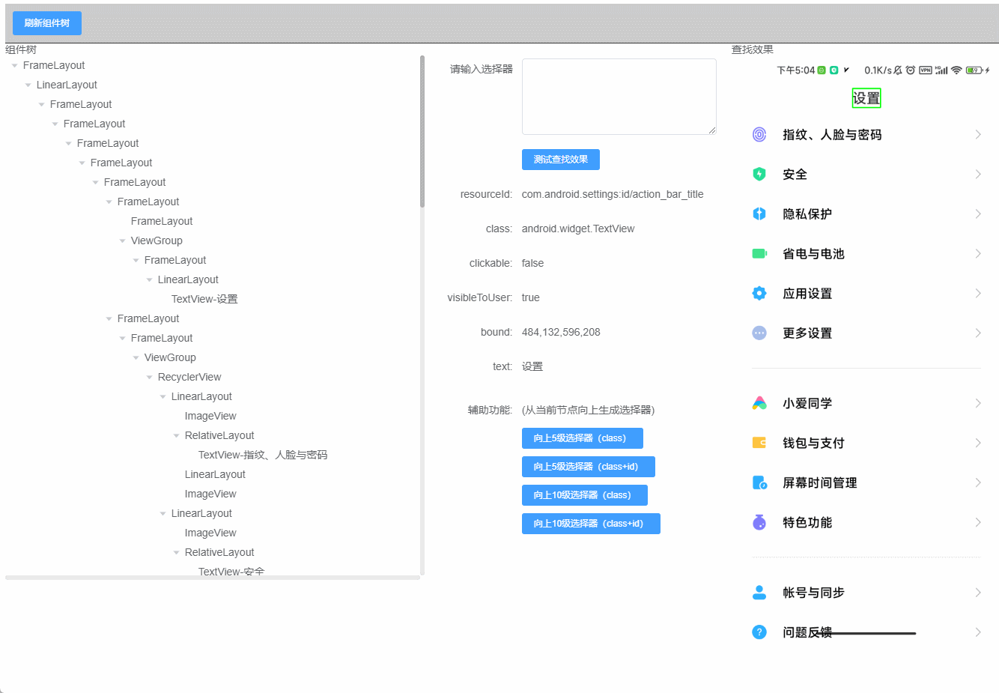

#### 操作步骤

- 选择器查找是一个比较高级的功能，文本查找的本质也是使用选择器查找。
#### 查找原理
- 安卓的屏幕UI本质上也是XML，可以使用XML导出工具，对屏幕XML进行分析。
- 如果你用过jquery的话，你会发现使用jqueyr的选择器查找元素，太方便了。
- cheerio实现了核心jQuery的子集，它在爬虫界非常流行，我们这里使用cheerio加载屏幕XML，就能很方便的使用jquey语法查找我们想要的元素了
- 然而这些操作AutoJS PC版软件都内置了，你只需要会简单的使用选择器，就可以了
#### 如何查看元素信息

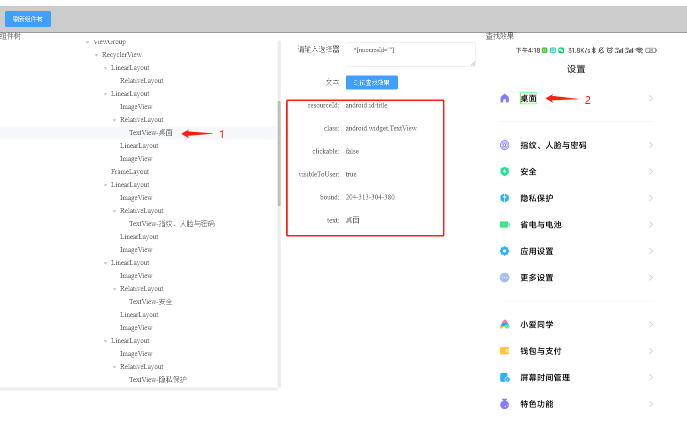

#### 如何使用选择器查找元素
- 如果你还不会使用jquery选择器，那么建议你可以先看下这两个文档，学习一下

  - [cheerio文档](https://github.com/cheeriojs/cheerio/wiki/Chinese-README)

  - [https://jquery.cuishifeng.cn](https://jquery.cuishifeng.cn/attributeEquals.html)

- 我们先来看一个截图

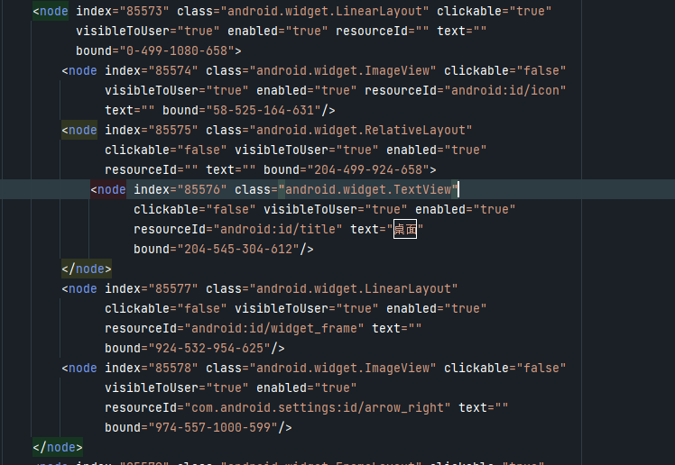

- android 屏幕XMl基本都是用属性定义的值，需要用到属性选择器，常用选择器我做了如下总结：

```text
//查找resourceId=android:id/title的元素
*[resourceId="android:id/title"]

//查找resourceId=android:id/title并且节点 text=桌面 的元素
*[resourceId="android:id/title"][text="桌面"]

//查找resourceId=android:id/title并且节点 text包含 设置 的元素
*[resourceId="android:id/title"][text*="设置"]

//后代元素查找（在给定的祖先元素下匹配所有的后代元素），多层级
*[resourceId="com.android.settings:id/scroll_headers"] *[text="设置"]

//在给定的父元素下匹配所有的子元素，单层级
*[class="android.widget.RelativeLayout"] > *[resourceId="android:id/title"][text="桌面"]

//选择使用第几个元素,从1开始
*[resourceId="android:id/title"]:eq(1)

```
#### 在进行选择器查找的时候可以实时测试，我们测试以下上边的选择器
  - `*[resourceId="android:id/title"]`


  - `*[resourceId="android:id/title"][text="桌面"]`


  - `*[resourceId="android:id/title"][text*="设置"]`


#### 什么时候要用到父子关系级选择，比如我们要查找 列表内文本包含设置 的元素，但是页面的标题也包含设置，我们不想选择到它。通过父子关系可以选择性的定位，这在某些软件文本相近或不好通过id定位时非常有用
  - `*[text*="设置"]`

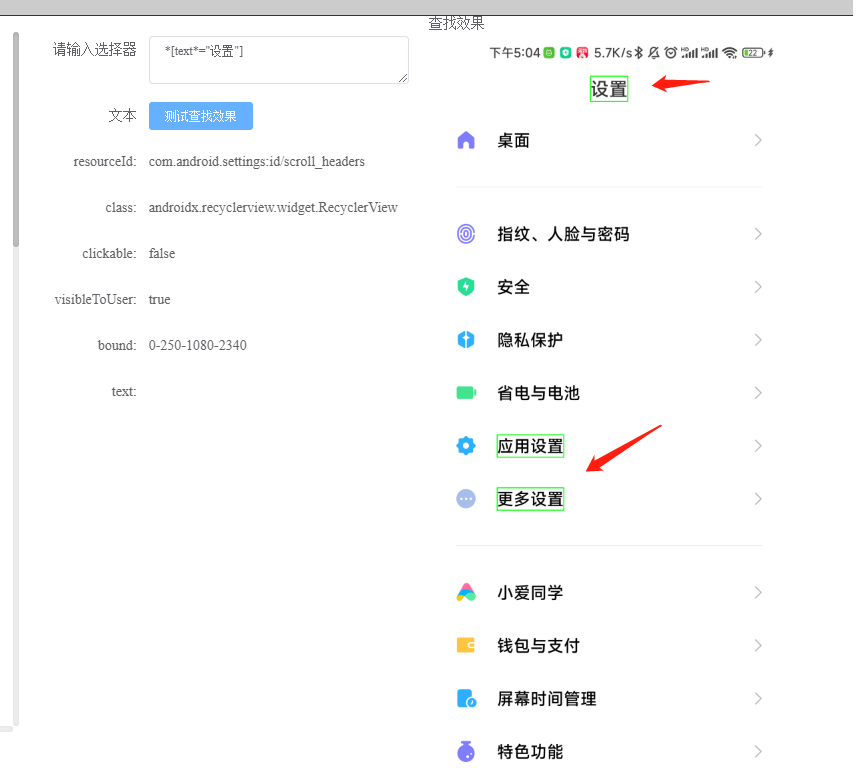

  - `*[resourceId="com.android.settings:id/scroll_headers"] *[text*="设置"]`


## 模拟按键

#### 动画演示


#### 操作步骤

在自动化流程中，有时候按键会更方便，比如返回上一级页面，这里我们已经集成了常见的按键


比如我们在更多设置页面，添加完成上述操作，点击运行，就会向手机发送返回按键指令


运行结果，我们看到手机已经返回上一级页面

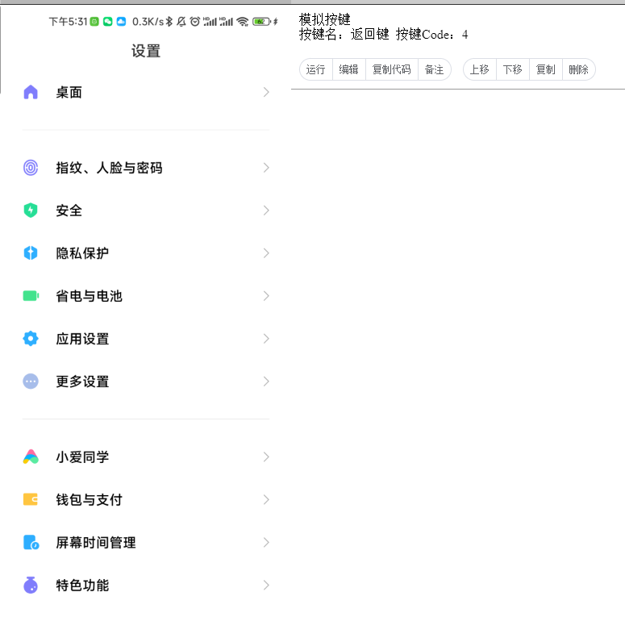

## 打开APP
启动一个APP需要获取到这个APP的启动参数：包名+Activity。我们需要在手机上打开app的同时，点击电脑上的获取按钮获取
- 比如我们获取到设置的启动信息为 `com.android.settings/.MainSettings`

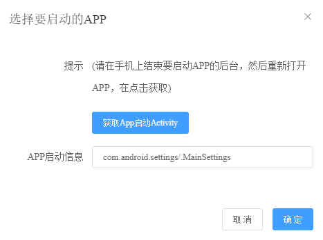

- 我们点击运行，看到手机会自动打开设置


## 结束APP
结束（停止）一个APP需要获取到这个APP的包名。我们需要在手机上打开app，点击电脑上的获取按钮获取，就能获取到前台应用的包名了
- 比如我们获取到设置的启动信息为 `com.android.settings`

 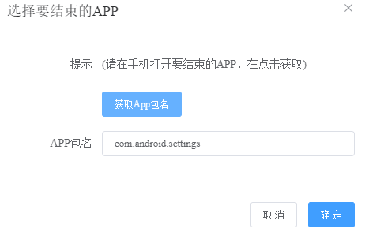

- 我们点击运行，看到设置已经退出，返回到了手机桌面


## 安装APP
在电脑上选择我们要安装的APK，点击运行后会自动安装APK

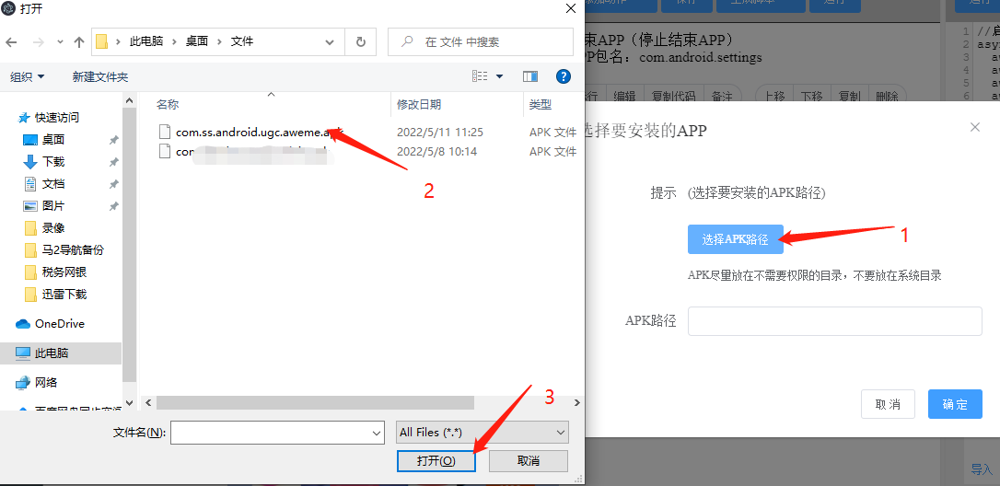

## 卸载APP 
卸载APP需要获取到这个APP的包名。我们需要在手机上打开app，点击电脑上的获取按钮获取，就能获取到这个应用的包名了
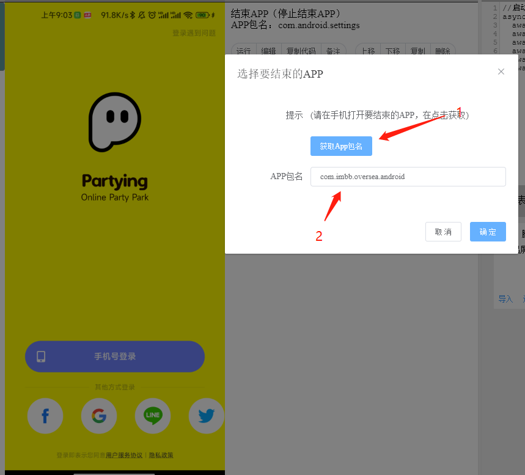

比如我们要卸载这个Partying应用，我们获取到包名后，点击运行后，这个APP会被卸载

## 自定义adb命令
有些时候我们可能需要自定义一些adb shell命令（进入adb shell 可以执行的命令）
- 比如我们要发送返回按键，你只需要写这部分命令即可
```shell
input keyevent 3
```
- [查看更多的adb用法](awesomeAdb.md)

## 生成脚本
- 当我们定义了某套流程后，我们点击`生成脚本->导入到右侧编辑器，即可完成代码生成`

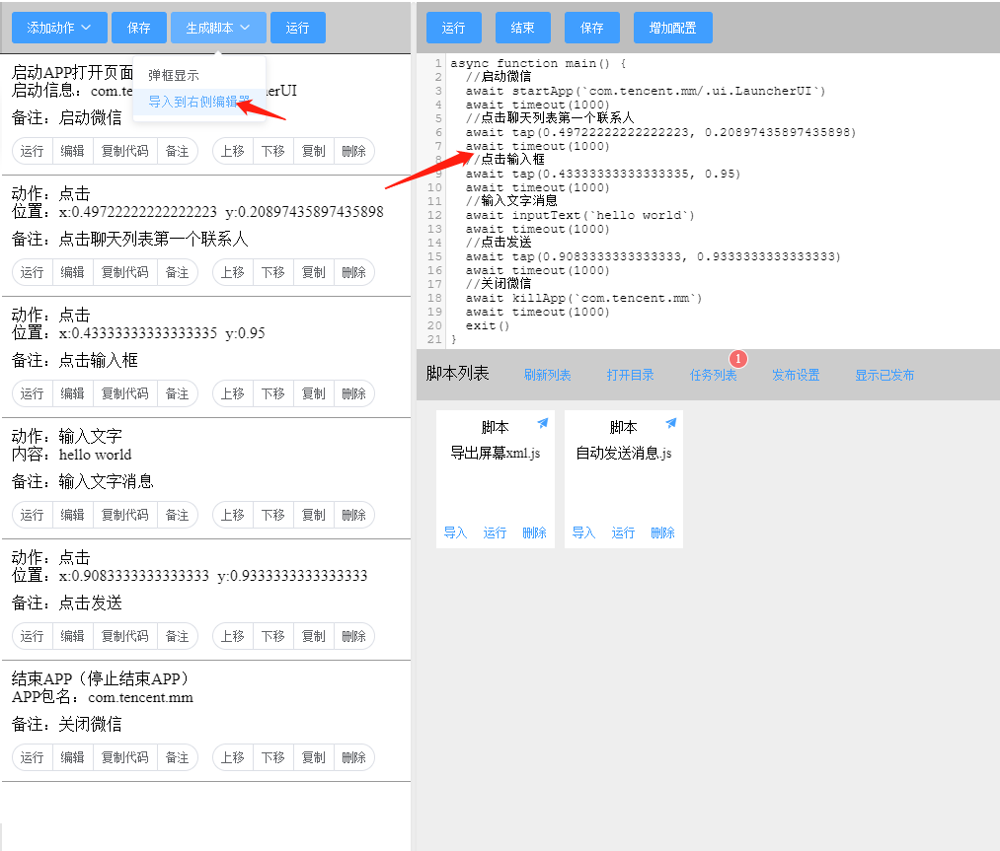

- 我们也可以复制单行代码，用于完善脚本的功能，比如我们想在关闭前返回到上级页面，我们直接点击脚本到指定位置处粘贴即可

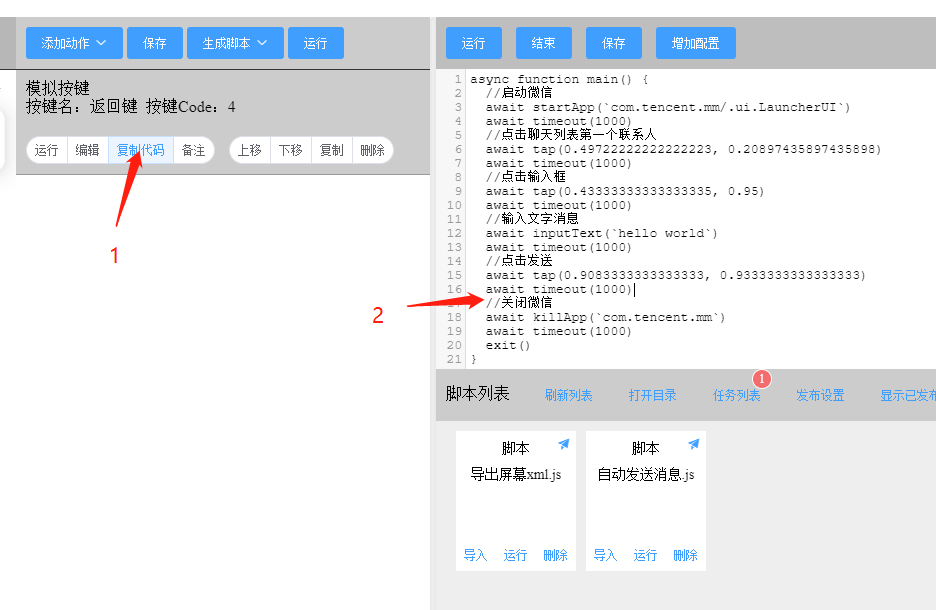

## 总结
这章我们主要讲解了，图形化添加动作，点击滑动，输入文本，图像查找，文本查找，选择器查找...的用法

下一章，我们将主要讲解脚本的api功能，如何在脚本中使用更高级的功能
